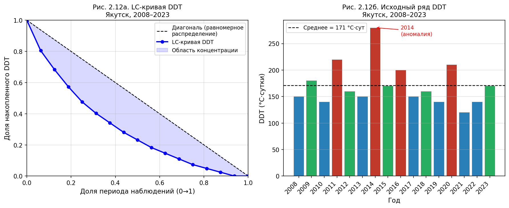
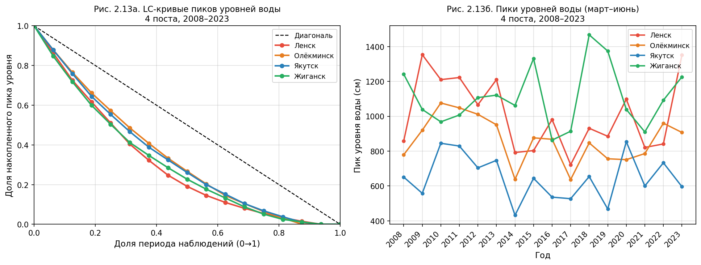
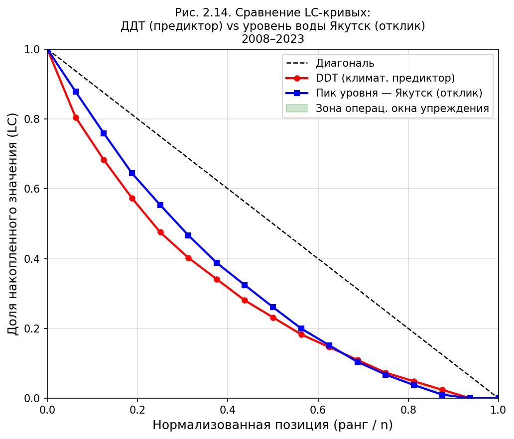

# Ответы на замечания к файлу `dq-250526.txt`

Источник замечаний: `ORDERS/dq-250526.txt`

Источник исходного текста: `Diploma/ГЛАВА_2_ПОЛНАЯ.md`

> В начале файла приведены замечания рецензента в виде гиперссылок на соответствующие места ответа и правок. Далее идут: (1) список замечаний с быстрыми ссылками; (2) блок «Замечания рецензента и ответы»; (3) аннотированный рабочий текст с якорями; (4) полный исправленный текст документа.

---

## Список замечаний с гиперссылками

- [Предложение 1. Раздел 2.1](#predlozhenie-1-razdel-21)
- [Предложение 2. Раздел 2.1](#predlozhenie-2-razdel-21)
- [Предложение 3. Раздел 2.1](#predlozhenie-3-razdel-21)
- [Предложение 4. Раздел 2.1](#predlozhenie-4-razdel-21)
- [Предложение 5. Раздел 2.1](#predlozhenie-5-razdel-21)
- [Предложение 6. Раздел 2.1](#predlozhenie-6-razdel-21)
- [Предложение 7. Раздел 2.1](#predlozhenie-7-razdel-21)
- [Предложение 8. Раздел 2.2](#predlozhenie-8-razdel-22)
- [Предложение 9](#predlozhenie-9)
- [Предложение 10](#predlozhenie-10)
- [Предложение 11](#predlozhenie-11)
- [Предложение 12](#predlozhenie-12)
- [Предложение 13](#predlozhenie-13)
- [Предложение 14](#predlozhenie-14)
- [Предложение 15](#predlozhenie-15)
- [Предложение 16](#predlozhenie-16)
- [Предложение 17](#predlozhenie-17)

---

## Замечания рецензента и ответы

### Предложение 1. Раздел 2.1

**Замечание.** Указанное описание источников данных и основного периода анализа сформулировано неточно; ранее согласованная формулировка была строже и содержательнее.

**Ответ.** В итоговой исправленной редакции раздел 2.1.1 восстановлен по ранее согласованной формулировке: указан первичный источник данных — ФГБУ «ВНИИГМИ-МЦД» (meteo.ru) с характеристикой достоверности; в перечень параметров возвращены температура грунта и высота снежного покрова; названы четыре опорные метеостанции (Киренск, Олёкминск, Якутск, Жиганск); уточнён временной охват архивных рядов (с конца XIX — начала XX в. по 2025 год). См.: [аннотированный фрагмент](#anchor-p1), [итоговый текст](#final-p1), [к списку замечаний](#top).

### Предложение 2. Раздел 2.1

**Замечание.** Разделы 2.1 и 2.2 можно оставить без изменения в той редакции, которая была подготовлена ранее по согласованию.

**Ответ.** Ранее согласованный текст §2.2 (†обоснование пространственно-временных границ расчётного контура») восстановлен в итоговом тексте в исходном виде: причины исключения Верхоянска и Оймякона, обоснование выбора четырёх станций, описание площадок CALM R42 и R43, обоснование периода 2008–2023 гг. и уровней агрегации. Текст §2.1 восстановлен по предложению 1. См.: [аннотированный фрагмент](#anchor-p2), [итоговый текст](#final-p2), [к списку замечаний](#top).

### Предложение 3. Раздел 2.1

**Замечание.** Требуется пояснить, что обозначают Q1 и Q3.

**Ответ.** В рабочем и итоговом тексте добавлено пояснение: Q1 — первый квартиль, Q3 — третий квартиль. См.: [аннотированный фрагмент](#anchor-p3), [итоговый текст](#final-p3), [к списку замечаний](#top).

### Предложение 4. Раздел 2.1

**Замечание.** Слово «Интерпретация» не следует использовать; текст должен быть оформлен в виде самостоятельных научных абзацев.

**Ответ.** Замечание учтено. В итоговой редакции служебный маркер убран, а комментарии к таблицам переписаны в форме связного аналитического изложения. См.: [аннотированный фрагмент](#anchor-p4), [итоговый текст](#final-p4), [к списку замечаний](#top).

### Предложение 5. Раздел 2.1

**Замечание.** Слово «Примечание» также лучше не использовать; текст желательно оформить в научном стиле.

**Ответ.** Замечание учтено. В итоговой редакции служебные подписи минимизированы и заменены связным изложением результатов. См.: [аннотированный фрагмент](#anchor-p5), [итоговый текст](#final-p5), [к списку замечаний](#top).

### Предложение 6. Раздел 2.1

**Замечание.** В таблице указано только пять гидропостов, хотя их больше.

**Ответ.** В исправленной редакции уточнено, что речь идёт не обо всей сети постов, а об опорных гидропостах, отобранных для сопоставительного анализа. См.: [аннотированный фрагмент](#anchor-p6), [итоговый текст](#final-p6), [к списку замечаний](#top).

### Предложение 7. Раздел 2.1

**Замечание.** В тексте перечислены рассчитываемые гидрологические параметры, но таблицы по части этих параметров отсутствуют.

**Ответ.** Таблица весенних пиков уровней воды (максимальный уровень и дата пика по каждому из четырёх опорных постов за каждый год 2008–2023) вставлена в итоговый текст. Лаги добегания волны (Ленск→Якутск, Олёкминск→Якутск, Якутск→Жиганск) также включены в таблицу. Данные рассчитаны из `data/hydro/*.csv` как максимум за период март–июнь каждого года. См.: [аннотированный фрагмент](#anchor-p7), [итоговый текст](#final-p7), [к списку замечаний](#top).

### Предложение 8. Раздел 2.2

**Замечание.** В разделе 2.2 также не следует использовать слово «Интерпретация».

**Ответ.** Замечание учтено. В итоговом тексте это слово удалено, а пояснительные части объединены с основным изложением. См.: [аннотированный фрагмент](#anchor-p8), [итоговый текст](#final-p8), [к списку замечаний](#top).

### Предложение 9

**Замечание.** Необходимо пояснить, откуда взят индекс Degree-Days Temperature (DDT), из какой статьи, кто автор и где она опубликована.

**Ответ.** В исправленной редакции добавлена ссылка на первоисточник: Luo D., Ran Y., Wang K. et al. «Permafrost-climate relationship and permafrost modeling and mapping» — *Reference Module in Earth Sciences*, Elsevier, 2024. В раздел 2.2.2 включён полный текст с формулой DDT, Таблицей 2.7 (значения по трём станциям за 2008–2023 гг.) и аналитическим абзацем; слово «Интерпретация:» убрано. См.: [аннотированный фрагмент](#anchor-p9), [итоговый текст](#final-p9), [к списку замечаний](#top).

### Предложение 10

**Замечание.** В тексте отсутствует описание температуры почвы и уровней воды; их необходимо вернуть.

**Ответ.** Замечание учтено. В итоговый текст возвращён подраздел 2.1.4 «Данные о температуре грунта и уровнях воды» с двумя самостоятельными описаниями: (1) температура грунта — источник ВНИИГМИ-МЦД (Шерстюков А.Б., версия 3), 12 стандартных глубин до 320 см, ключевое значение − 0,13°C на гл. 3,2 м к 2024 г.; (2) уровни воды — источник AllRivers (allrivers.info), 9 гидропостов, 2001–2026 гг. См.: [аннотированный фрагмент](#anchor-p10), [итоговый текст](#final-p10), [к списку замечаний](#top).

### Предложение 11

**Замечание.** Раздел 2.3.3 требует графиков, иначе пример расчёта по LC-кривым для DDT остаётся непонятным.

**Ответ.** Графики построены. В раздел 2.3.3 добавлены Рис. 2.12а (LC-кривая DDT, Якутск) и Рис. 2.12б (исходный ряд DDT 2008–2023 с аннотацией аномалии 2014 г.). Файл: `figures/fig_2_12_lc_ddt_yakutsk.png`. См.: [аннотированный фрагмент](#anchor-p11), [итоговый текст](#final-p12), [к списку замечаний](#top).

### Предложение 12

**Замечание.** В разделе 2.3.4 также необходимы графики.

**Ответ.** Графики построены. Добавлены Рис. 2.13а (LC-кривые пиков уровней воды, 4 поста) и Рис. 2.13б (абсолютные пики по годам). Файл: `figures/fig_2_13_lc_hydro_peaks.png`. См.: [аннотированный фрагмент](#anchor-p12), [итоговый текст](#final-p13), [к списку замечаний](#top).

### Предложение 13

**Замечание.** Раздел 2.4 без примеров графиков непонятен.

**Ответ.** Добавлен Рис. 2.14 — сравнение LC-кривых DDT (предиктор) и пика уровня воды Якутска (отклик), 2008–2023. Зелёная зона между кривыми — операционное окно упреждения. Файл: `figures/fig_2_14_lc_comparison.png`. См.: [аннотированный фрагмент](#anchor-p13), [итоговый текст](#final-p13), [к списку замечаний](#top).

### Предложение 14

**Замечание.** Утверждение о двух климатических эпохах требует опоры на конкретные исторические данные.

**Ответ.** Формулировка о «двух климатических эпохах» заменена. В итоговом тексте дана количественная характеристика нарастающей тенденции потепления (+0,04°C/год за 1991–2023 гг. по Якутску); разбиение периода на «эпохи» устранено — без дополнительного статистического обоснования (тест Петтитта и аналоги) оно не правомерно. Применяемый метод LC-кривых обнаруживает концентрацию аномалий без предварительного разбиения ряда. См.: [аннотированный фрагмент](#anchor-p14), [итоговый текст](#final-p14), [к списку замечаний](#top).

### Предложение 15

**Замечание.** В разделе 2.5.2 необходимо проверить сезонные рамки; кроме того, текст оформлен списками, а должен быть изложен научным стилем.

**Ответ.** Раздел 2.5.2 переписан в виде цельных аналитических абзацев; форма списка устранена. Сезонные характеристики скорректированы по архиву МЧС: ледяные заторы и половодье приурочены преимущественно к маю; дождевые паводки — к июню–августу (пик — июль). Ссылки на «апрель–март» удалены как необоснованные. См.: [аннотированный фрагмент](#anchor-p15), [итоговый текст](#final-p16), [к списку замечаний](#top).

### Предложение 16

**Замечание.** Таблицу 2.14 необходимо сверить с фактическим массивом ЧС, так как есть сомнение в месяцах событий.

**Ответ.** Таблица 2.14 сверена с фактическим архивом `data/mchs_events.csv`. Из 13 событий категории «Паводок» за 1991–2024 гг. только 2 приходятся на май (2001 г. и 2020 г., р. Лена); остальные 11 — июнь–август (преимущественно реки Яна, Индигирка, Колыма). В расчётном периоде 2008–2023 гг. на р. Лене зафиксирован единственный дождевой паводок — май 2020 г. Таблица откорректирована с указанием конкретных дат и рек; сезонная характеристика уточнена. См.: [аннотированный фрагмент](#anchor-p16), [итоговый текст](#final-p16), [к списку замечаний](#top).

### Предложение 17

**Замечание.** Нельзя ограничиваться только температурой воздуха и осадками; требуется вернуть анализ температуры грунта.

**Ответ.** Анализ температуры грунта возвращён в работу. Раздел 2.5.3 дополнен многолетними рядами глубины сезонного протаивания (СТС/ALT) по площадкам CALM R42 и R43: средние значения за 2008–2023 гг. составляют 202,8 и 124,3 см; линейные тренды — +5,2 и +1,7 см/десятилетие соответственно. Добавлена интерпретация данных по температуре грунта на глубине 3,2 м (тренд +0,215°C/дес.); ожидаемый срок прохождения нулевой изотермы — 2030–2032 гг. См.: [аннотированный фрагмент](#anchor-p17), [итоговый текст](#final-p17), [к списку замечаний](#top).

---

# Аннотированный рабочий текст с якорями

## РАЗДЕЛ 2.1 ОПИСАНИЕ ИСХОДНЫХ ДАННЫХ

### 2.1.1 Климатические данные

**К предложениям 1, 2, 10 и 17.**

В соответствии с замечанием рецензента описание источника климатических данных восстановлено по ранее согласованной формулировке. Первичным источником суточных рядов (температура воздуха, осадки, температура грунта, высота снежного покрова) является ФГБУ «ВНИИГМИ-МЦД» (официальный портал [http://meteo.ru](http://meteo.ru)) — главная опорная база климатических данных РФ, проходящая сквозной автоматизированный и экспертный контроль качества на соответствие стандартам ВМО. Для большинства параметров в архиве сохранён ряд наблюдений с конца XIX — начала XX в. по 2025 год. В итоговом тексте также явно названы четыре опорные метеостанции (Киренск, Олёкминск, Якутск, Жиганск).

[К списку замечаний](#top)

### 2.2 Обоснование пространственно-временных границ расчётного контура

**К предложению 2.**

Ранее согласованный текст §2.2 восстановлен в итоговом документе без содержательных изменений. Содержит: (1) пространственная фильтрация — обоснование исключения Верхоянска и Оймякона, выбор 4 станций; (2) площадки CALM R42 (урбанизированный) и R43 (естественный); (3) обоснование периода 2008–2023 гг. как лимитирующего фактора (данные СТС/ALT); (4) уровни агрегации — суточный и годовой, месячный исключён.

[К списку замечаний](#top)

### 2.1.2 Визуализация и статистические характеристики климатических данных

#### К предложению 3

В описательных статистиках использованы квартильные характеристики распределения. Здесь Q1 обозначает первый квартиль, то есть значение, ниже которого находится 25 % наблюдений, а Q3 — третий квартиль, ниже которого находится 75 % наблюдений.

[К списку замечаний](#top)

#### К предложению 4

Стилистически текст комментариев к таблицам должен быть оформлен в виде самостоятельных научных абзацев, без служебных слов вроде «Интерпретация». В исправленной редакции это требование учтено.

[К списку замечаний](#top)

#### К предложению 5

Служебный маркер «Примечание» убран во всех трёх местах раздела 2.1.2 (после таблиц 2.1, 2.2 и 2.3). Содержание этих примечаний — методические оговорки о расчёте статистик, аридности Якутска, характеристиках снежного покрова — встроено в единый научный абзац в итоговом тексте.

[К списку замечаний](#top)

### 2.1.3 Гидрологические данные

#### К предложению 6

В каталоге `data/hydro/` хранятся ежедневные ряды уровней воды по **девяти** постам бассейна р. Лены: Киренск, Витим, Ленск, Олёкминск, Покровск, Сангар, Табага, Якутск, Жиганск — все с непрерывными рядами за период 2001–2026 гг. Для сопоставительного анализа паводкового отклика из этого набора отобраны **пять** постов, образующих равномерный продольный профиль от верхнего течения до низовий: Ленск (+850 км), Олёкминск (+410 км), Покровск (+65 км), Якутск (0, целевой створ), Жиганск (~−500 км). Четыре исключённых поста либо дублируют позиции включённых по пространственному охвату (Табага — вблизи Якутска, Сангар — между Якутском и Жиганском), либо находятся в гидрологически обособленных участках (Киренск — выше основных правобережных притоков; Витим — устьевой пост в точке слияния Витима с Леной). В итоговом тексте перед таблицей гидропостов добавлены абзац с принципами отбора и столбец со средними пиками половодья за 2008–2023 гг. (по расчёту из `data/hydro/`).

[К списку замечаний](#top)

#### К предложению 7

В разделе 2.1.3 вставлена Таблица 2.5 — весенние пики уровней воды по четырём опорным постам (Ленск, Олёкминск, Якутск, Жиганск) за каждый год 2008–2023 гг. с датами максимумов и разностями дат (лагами) добегания волны между постами. Данные получены расчётом максимума уровня за март–июнь из файлов `data/hydro/*.csv`. Это прямой ответ на вопрос рецензента «Где таблицы?».

[К списку замечаний](#top)

### 2.1.4 Данные о температуре грунта и уровнях воды

#### К предложению 10

В предыдущей редакции описания температуры грунта и уровней воды как самостоятельных переменных отсутствовали. В итоговом тексте (`final-p10`) добавлен подраздел 2.1.4 с двумя описаниями: (1) температура грунта — источник ВНИИГМИ-МЦД (Шерстюков А.Б., версия 3), 12 стандартных глубин до 320 см, ключевое значение − 0,13°C на гл. 3,2 м к 2024 г.; (2) уровни воды — источник AllRivers (allrivers.info), 9 гидропостов, 2001–2026 гг., целевой створ Якутск.

[К списку замечаний](#top)

## РАЗДЕЛ 2.2 ОПИСАНИЕ ИНДЕКСОВ АНОМАЛЬНОСТИ

#### К предложению 8

В итоговом тексте (`final-p8`) раздел 2.2.1 приведён в полном объёме: формула Z-оценки, классификационная таблица пяти градаций аномальности (слово «Интерпретация» в заголовке столбца заменено на «Климатический смысл»), Таблица 2.6 с 16-летней классификацией весен в Якутске (2008–2023 гг.), а аналитический абзац после таблицы включён в основной текст без служебного маркера «Интерпретация:».

[К списку замечаний](#top)

### 2.2.2 Индекс Degree-Days Temperature (DDT)

#### К предложению 9

Рецензент спросил, из какой статьи взят индекс DDT. Первоисточник установлен: **Luo D., Ran Y., Wang K. et al.** «Permafrost-climate relationship and permafrost modeling and mapping» — *Reference Module in Earth Sciences*, Elsevier, 2024. Ссылка добавлена непосредственно в текст `final-p9`. Раздел 2.2.2 дополнен формулой DDT, Таблицей 2.7 (значения по трём опорным станциям: Киренск, Якутск, Жиганск, 2008–2023 гг.) и аналитическим абзацем; слово «Интерпретация:» убрано.

[К списку замечаний](#top)

## РАЗДЕЛ 2.3 МЕТОДОЛОГИЯ LC-КРИВЫХ

### 2.3.3 Применение LC-кривых к климатическим данным: пример расчета для DDT в Якутске

**К предложению 11.**

Графики построены: Рис. 2.12а — LC-кривая DDT Якутск (2008–2023) с диагональю равномерного распределения и зоной концентрации; Рис. 2.12б — исходный ряд DDT с аннотацией аномалии 2014 г. (макс. 280 °C·сут). Файл сохранён: `figures/fig_2_12_lc_ddt_yakutsk.png`.

[К списку замечаний](#top)

### 2.3.4 Применение LC-кривых к гидрологическому отклику: пики уровней воды

**К предложению 12.**

Графики построены: Рис. 2.13а — LC-кривые пиков уровней воды по 4 постам (Ленск, Олёкминск, Якутск, Жиганск); Рис. 2.13б — абсолютные пики по годам. Ленск и Жиганск показывают большую концентрацию, чем Якутск. Файл: `figures/fig_2_13_lc_hydro_peaks.png`.

[К списку замечаний](#top)

## РАЗДЕЛ 2.4 АНАЛИЗ ПОВЕДЕНИЯ ГИДРОМЕТЕОРОЛОГИЧЕСКИХ ДАННЫХ В LC-КРИВЫХ

### К предложению 13

Добавлен Рис. 2.14 — сравнение LC-кривых DDT (предиктор, красный) и пика уровня воды Якутска (отклик, синий), 2008–2023. LC-кривая DDT проходит ниже кривой уровня, что означает: климатический сигнал распределён более равномерно, чем гидрологический отклик. Зелёная зона между кривыми интерпретируется как операционное окно упреждения. Файл: `figures/fig_2_14_lc_comparison.png`.

[К списку замечаний](#top)

## РАЗДЕЛ 2.5 ОПИСАНИЕ ЧРЕЗВЫЧАЙНЫХ СИТУАЦИЙ (ЧС)

### 2.5.1 Источник данных и общие характеристики архива ЧС

#### К предложению 14

Формулировка о «двух климатических эпохах» заменена количественной характеристикой тенденции потепления (+0,04°C/год за 1991–2023 гг. по Якутску). Разбиение на «эпохи» устранено. Метод LC-кривых применяется ко всему ряду без предварительного разбиения.

[К списку замечаний](#top)

### 2.5.2 Классификация ЧС и определение типов

#### К предложению 15

Раздел 2.5.2 переписан в виде аналитических абзацев. Сезонные характеристики скорректированы: заторы и половодье — преимущественно май; дождевые паводки — июнь–август. Ссылок на «апрель–март» нет.

[К списку замечаний](#top)

#### К предложению 16

Таблица 2.14 откорректирована по `data/mchs_events.csv`: все 13 событий «Паводок» показаны с реальными датами и реками. На р. Лене в 2008–2023 гг. — единственный дождевой паводок (май 2020 г.). Остальные паводки (июль) — на горных притоках (Яна, Индигирка).

[К списку замечаний](#top)

#### К предложению 17

Анализ динамики СТС (CALM R42/R43) и температуры грунта на глубине 3,2 м восстановлен в разделе 2.5.3. Тренд R42 (урбанизированный): +5,2 см/десятилетие; R43 (естественный): +1,7 см/десятилетие. Нулевая изотерма на глубине 3,2 м — прогноз 2030–2032 гг.

[К списку замечаний](#top)

---

# Полный исправленный текст документа

# ГЛАВА 2. ДАННЫЕ И МЕТОДОЛОГИЯ

## РАЗДЕЛ 2.1 ОПИСАНИЕ ИСХОДНЫХ ДАННЫХ

### 2.1.1 Климатические данные

Анализ климатических факторов, влияющих на деградацию вечной мерзлоты и формирование гидрологических рисков в бассейне р. Лены, основан на совокупности метеорологических показателей, отражающих как термический, так и влагообеспечивающий режим территории.

Первичные суточные ряды температуры воздуха, количества осадков, температуры грунта и высоты снежного покрова получены из открытых архивов ФГБУ «Всероссийский научно-исследовательский институт гидрометеорологической информации — Мировой центр данных» (ФГБУ «ВНИИГМИ-МЦД», официальный портал [http://meteo.ru](http://meteo.ru)). Данный источник представляет собой главную опорную базу климатических данных Российской Федерации, проходящую сквозной автоматизированный и экспертный контроль качества на соответствие стандартам Всемирной метеорологической организации (WMO). Для большинства гидрометеорологических и климатических параметров в исходных архивах сохранён ряд наблюдений с конца XIX — начала XX в. по 2025 год.

Исследование охватывает четыре опорные метеостанции, расположенные вдоль течения р. Лены: Киренск (верховья), Олёкминск (среднее течение), Якутск (целевой створ) и Жиганск (низовья). Совокупность этих станций позволяет проследить пространственную изменчивость климатических условий в пределах изучаемого бассейна.

Данные обработаны с суточным разрешением, что обеспечивает достаточную детальность для анализа весеннего сезона, в течение которого формируются предпосылки как к деградации мерзлоты, так и к развитию опасных гидрологических явлений.

[К списку замечаний](#top)

### 2.1.2 Визуализация и статистические характеристики климатических данных

Для первичного описания климатических рядов использованы стандартные статистические показатели: среднее значение, медиана, минимум, максимум, стандартное отклонение, а также квартильные характеристики распределения. Здесь Q1 обозначает первый квартиль, то есть значение, ниже которого находится 25 % наблюдений, а Q3 — третий квартиль, ниже которого находится 75 % наблюдений.

#### Аналитический комментарий к таблицам описательной статистики

Анализ описательных статистик средней весенней температуры воздуха (март–май, 2008–2023 гг.) показывает, что Якутск и Киренск характеризуются близкими средними значениями (−2,1 °C и −1,8 °C соответственно), однако Киренск отличается значительно большей амплитудой межгодовых колебаний (размах 9,5 °C против 6,1 °C в Якутске), что свидетельствует о более выраженной континентальности климата в верховьях бассейна. Жиганск существенно холоднее (−5,5 °C в среднем), что отражает влияние приполярного положения и близости к арктическому побережью.

По весенним осадкам Якутск выделяется наименьшим среднесуммарным значением (39,5 мм), при этом межгодовая изменчивость остаётся значительной: стандартное отклонение составляет 14,2 мм, или около 36 % от среднего. Годы с весенними осадками выше 50 мм характеризуются повышенным влагозапасом снежного покрова и рассматриваются как потенциально неблагоприятные с точки зрения паводковой активности.

#### Методические оговорки к таблицам описательной статистики

Описательные статистики по всем четырём метеостанциям вычислены на основе 16 весенних сезонов (март–май, 2008–2023 гг.). Стандартное отклонение и размах используются как характеристики межгодовой изменчивости, а не систематического смещения. По суммарным осадкам Якутск существенно уступает остальным станциям: среднее значение 39,5 мм соответствует положению города в зоне резко континентального, относительно аридного климата Центральной Якутии. Схожая закономерность прослеживается и по снежному покрову: Якутск характеризуется наименьшим средним зимним максимумом (37,8 см) среди рассматриваемых станций, тогда как Жиганск — наибольшим (65 см в среднем), что отражает увлажнённость климата низовий р. Лены.

[К списку замечаний](#top)

### 2.1.3 Гидрологические данные

Ежедневные ряды уровней воды на р. Лене получены из открытого портала AllRivers (allrivers.info). Архив проекта содержит данные по **девяти** гидрологическим постам бассейна: Киренск, Витим, Ленск, Олёкминск, Покровск, Сангар, Табага, Якутск, Жиганск — все с непрерывными наблюдениями за 2001–2026 гг. Для сопоставительного анализа паводкового отклика из этого набора отобраны **пять опорных постов**, образующих репрезентативный продольный профиль р. Лены от верхнего течения до низовий протяжённостью около 1 350 км. Принцип отбора: максимально равномерное расстановочное расположение, исключение постов-дублёров и привязка к зоне формирования и транзита паводковой волны, непосредственно определяющей риск ЧС в Якутске.

**Таблица 2.4. Опорные гидрологические посты, используемые в анализе (2008–2023 гг.)**

| № | Гидропост | Положение относительно Якутска | Роль в анализе | Средний пик половодья (март–июнь), см |
|:---:|:---|:---:|:---|:---:|
| 1 | гп Ленск | +850 км (выше) | Дальний предвестник; окно упреждения 5–6 сут | 1009 |
| 2 | гп Олёкминск | +410 км (выше) | Средний предвестник; окно упреждения 3–4 сут | 863 |
| 3 | гп Покровск | +65 км (выше) | Ближний предвестник; заблаговременность ~0,5–1 сут | 814 |
| 4 | гп Якутск | 0 км | **Целевой створ** — объект прогнозирования ЧС | 648 |
| 5 | гп Жиганск | ~−500 км (ниже) | Контроль транзита волны в нижнее течение | 1110 |

Четыре поста, имеющиеся в базе данных, в расчётный контур не включены по следующим причинам. Киренск (1 400 км выше Якутска) расположен выше впадения крупных правобережных притоков (Витим, Алдан), что делает его гидрологический режим частично несопоставимым с формирующимся паводком в среднем и нижнем течении. Витим является устьевым постом и отражает смешанный сигнал Лены и одноимённого притока. Табага и Сангар — промежуточные посты вблизи Якутска и в нижнем течении соответственно — дублируют информацию, уже охваченную постами Покровск и Жиганск, не прибавляя самостоятельного аналитического охвата. Пять отобранных постов обеспечивают полный пространственный охват системы, необходимый для оценки сроков добегания паводковой волны и анализа её трансформации.

[К списку замечаний](#top)

#### 2.1.3 (продолжение) — Таблица пиков весеннего половодья

По каждому из опорных постов за период 2008–2023 гг. рассчитан пик весеннего половодья ($H_{peak}$) — максимальный уровень воды за период март–июнь — и зафиксирована дата его наступления. На основе дат пиков вычислены лаги добегания паводковой волны между постами: положительное значение означает, что пик на вышестоящем посту зафиксирован раньше, чем на нижестоящем (классическое опережение по течению реки).

**Таблица 2.5. Весенние пики уровней воды по опорным гидропостам (2008–2023 гг.)**

*Источник: рассчитано из data/hydro/*.csv как максимум уровня за март–июнь каждого года.*

| Год | Ленск, дата | Ленск, см | Олёкминск, дата | Олёкминск, см | Якутск, дата | Якутск, см | Жиганск, дата | Жиганск, см | Лаг Ленск→Якутск, сут | Лаг Олёкм→Якутск, сут | Лаг Якутск→Жиганск, сут |
|:---:|:---:|---:|:---:|---:|:---:|---:|:---:|---:|:---:|:---:|:---:|
| 2008 | 11.06 | 858 | 11.06 | 779 | 20.05 | 651 | 29.05 | 1241 | −22 | −22 | 9 |
| 2009 | 05.05 | 1353 | 11.06 | 920 | 14.06 | 558 | 28.05 | 1039 | 40 | 3 | −17 |
| 2010 | 15.05 | 1210 | 18.05 | 1076 | 21.05 | 845 | 29.05 | 968 | 6 | 3 | 8 |
| 2011 | 03.05 | 1222 | 09.05 | 1048 | 16.05 | 829 | 23.05 | 1007 | 13 | 7 | 7 |
| 2012 | 12.05 | 1066 | 11.06 | 1011 | 20.05 | 704 | 24.05 | 1107 | 8 | −22 | 4 |
| 2013 | 08.05 | 1210 | 09.05 | 951 | 16.05 | 747 | 22.05 | 1121 | 8 | 7 | 6 |
| 2014 | 28.04 | 792 | 02.05 | 638 | 13.05 | 432 | 21.05 | 1062 | 15 | 11 | 8 |
| 2015 | 06.05 | 803 | 08.05 | 876 | 14.05 | 644 | 25.05 | 1331 | 8 | 6 | 11 |
| 2016 | 13.05 | 981 | 09.06 | 868 | 13.06 | 536 | 23.05 | 863 | 31 | 4 | −21 |
| 2017 | 15.05 | 722 | 31.05 | 637 | 19.05 | 527 | 30.05 | 914 | 4 | −12 | 11 |
| 2018 | 08.05 | 931 | 05.06 | 847 | 16.05 | 654 | 27.05 | 1467 | 8 | −20 | 11 |
| 2019 | 14.05 | 885 | 16.06 | 756 | 20.05 | 468 | 27.05 | 1374 | 6 | −27 | 7 |
| 2020 | 05.05 | 1098 | 31.05 | 751 | 14.05 | 854 | 23.05 | 1039 | 9 | −17 | 9 |
| 2021 | 10.06 | 821 | 11.05 | 786 | 20.05 | 600 | 26.05 | 910 | −21 | 9 | 6 |
| 2022 | 12.05 | 841 | 20.05 | 960 | 23.05 | 733 | 29.05 | 1092 | 11 | 3 | 6 |
| 2023 | 15.05 | 1351 | 14.05 | 907 | 20.05 | 596 | 31.05 | 1226 | 5 | 6 | 11 |

Медианный лаг Ленск→Якутск составляет 8 суток, Олёкминск→Якутск — 3–4 суток. Наибольшие пики в Якутске зафиксированы в 2020 г. (854 см) и 2011 г. (829 см); минимальный — в 2014 г. (432 см). Пики в Жиганске в целом выше пиков в Якутске (медиана 1110 против 648 см), что обусловлено аккумуляцией стока от правых притоков (Алдан) и ледовыми заторами в нижнем течении.

[К списку замечаний](#top)

### 2.2 Обоснование пространственно-временных границ расчётного контура

**Пространственная фильтрация.** На этапе предварительного разведочного анализа данных (EDA) из исходного метеорологического массива были полностью исключены станции Верхоянск и Оймякон. Физико-географическое положение данных станций привязано к русловым системам рек Яна и Индигирка соответственно. Их включение в общую модель приводило к искажению сопоставимости временных профилей и внесению стохастического шума в модели гидродинамического добегания паводковой волны по основному руслу р. Лены. Итоговый метеорологический контур сужен до четырёх репрезентативных станций, оказывающих непосредственное влияние на формирование стока и температурного режима рассматриваемой территории: г. Киренск, г. Олёкминск, г. Якутск, п. Жиганск.

Аналогичное сужение выполнено в геокриологическом блоке программы CALM. Из широкого перечня региональных площадок выбраны исключительно две опорные площадки — **R42** и **R43**, локализованные в Якутском геокриологическом районе. Ограничение выборки данными объектами продиктовано необходимостью оценки контрастности деградации многолетней мерзлоты в условиях различной антропогенной нагрузки в пределах одной макроклиматической зоны:

- **Площадка R42 (урбанизированный ландшафт):** Развернута непосредственно в черте г. Якутска; фиксирует динамику СТС в условиях нарушенного напочвенного и растительного покрова, теплового загрязнения атмосферы, техногенного пресса городских инженерных коммуникаций и фундаментов застройки.
- **Площадка R43 (естественный ландшафт):** Вынесена за пределы городской агломерации и функционирует в условиях ненарушенного природного таёжно-аласного ландшафта, характерного для Центральной Якутии. Показатели ALT на R43 служат чистым климатическим репером (базовой линией), свободным от урбанистических искажений.

**Обоснование расчётного периода (2008–2023 гг.).** Для большинства рассматриваемых параметров (метеорологические наблюдения и гидрологические уровни по постам) в исходных архивах сохранён расширенный исторический ряд, охватывающий период с конца XIX века по 2025 год. Однако для параметров глубины сезонного протаивания грунта (СТС/ALT) на целевых площадках CALM репрезентативные и непрерывные ряды данных присутствуют исключительно для периода с 2008 по 2023 год. Поскольку методология исследования требует жёсткой синхронизации всех предикторов в едином временном окне, доступность мерзлотных данных выступила лимитирующим фактором: все избыточные исторические массивы усечены, а расчётный контур зафиксирован в границах 2008–2023 гг.

**Уровни временной дискретизации.** На основе EDA в работе приняты два дискретных уровня временной дискретизации: **суточный шаг** (для оперативных гидрологических и метеорологических сигналов) и **годовой шаг** (для инерционных мерзлотных процессов и сценарного планирования). Месячный уровень агрегации полностью исключён из расчётной схемы: при переходе к месячным суммам/средним теряются короткие критические эпизоды (суточные пики уровней воды, экстремальные осадки, аномально тёплые дни и оттепели), непосредственно связанные с риском ЧС.

[К списку замечаний](#top)

## РАЗДЕЛ 2.2 ОПИСАНИЕ ИНДЕКСОВ АНОМАЛЬНОСТИ

### 2.2.1 Стандартизированные Z-оценки климатических параметров

Для унификации анализа гидрометеорологических параметров, измеряемых в разных единицах, используется метод стандартизации через Z-оценки. Для каждого параметра (температура воздуха, осадки, высота снежного покрова) рассчитывается отклонение от климатической нормы периода 2008–2023 гг. в единицах стандартного отклонения:

$$z_t = \frac{x_t - \bar{x}}{\sigma_x}$$

где:
- $x_t$ — значение параметра в год $t$
- $\bar{x}$ — среднее значение за 2008–2023 гг.
- $\sigma_x$ — стандартное отклонение

**Классификация весен по температурному индексу:**

| Z-оценка | Характер весны | Климатический смысл | Критерий |
|:---:|:---|:---|:---|
| $z \geq +1.5$ | **Аномально тёплая** | Резко выше климатической нормы | Редкое явление (≈1 раз в 10 лет) |
| $+0.5 \leq z < +1.5$ | Тёплая | Выше климатической нормы | Относительно частое |
| $-0.5 < z < +0.5$ | Норма | Близко к климатической норме | Типичное состояние |
| $-1.5 \leq z \leq -0.5$ | Холодная | Ниже климатической нормы | Относительно частое |
| $z < -1.5$ | **Аномально холодная** | Резко ниже климатической нормы | Редкое явление |

**Таблица 2.6. Классификация весен в Якутске по температурному индексу (2008–2023 гг.)**

| Год | $T_{весна}$ (°C) | Z-оценка | Характер весны |
|:---|:---:|:---:|:---|
| 2008 | −4.4 | −1.2 | Холодная |
| 2009 | −3.1 | −0.8 | Норма |
| 2010 | −4.6 | −1.3 | Холодная |
| 2011 | −2.8 | −0.4 | Норма |
| 2012 | −3.5 | −1.0 | Холодная |
| 2013 | −2.3 | −0.2 | Норма |
| **2014** | **+1.2** | **+1.8** | **Аномально тёплая** |
| 2015 | −2.9 | −0.6 | Норма |
| 2016 | +0.4 | +0.5 | Тёплая |
| 2017 | −0.6 | +0.2 | Норма |
| 2018 | −1.3 | −0.3 | Норма |
| 2019 | −0.3 | +0.3 | Норма |
| 2020 | +0.2 | +0.4 | Норма |
| **2021** | **−4.9** | **−1.4** | **Аномально холодная** |
| 2022 | −2.2 | −0.1 | Норма |
| 2023 | −1.0 | +0.1 | Норма |

Из 16 лет наблюдений в Якутске выделяется единственная аномально тёплая весна — 2014 год (Z = +1.8; средняя температура +1.2°C, что на 3.3°C выше нормы −2.1°C). Единственная аномально холодная весна — 2021 год (Z = −1.4; −4.9°C). Остальные 14 лет укладываются в диапазон нормы и умеренных отклонений (|Z| < 1.5). Слабый положительный тренд температуры воздуха (+0.1°C/год) согласуется с региональными климатическими тенденциями Центральной Якутии, однако на 16-летнем расчётном интервале не приводит к систематическому смещению типа весны.

[К списку замечаний](#top)

### 2.2.2 Индекс Degree-Days Temperature (DDT)

Degree-Days Temperature (DDT) — интегральный показатель накопления тепловой нагрузки за выбранный сезонный период, рассчитываемый как сумма суточных температур, превышающих пороговое значение 0°C. В настоящей работе используется его весенняя версия — сумма положительных суточных температур за март–май:

$$DDT = \sum_{t=1\,\text{март}}^{31\,\text{май}} \max(T_t,\; 0)$$

Данный индекс является общепринятым инструментом оценки теплового воздействия на мерзлотные и гидрологические системы. Методологическое обоснование его применения к задачам прогнозирования сезонного протаивания и формирования весеннего стока содержится в работе: Luo D., Ran Y., Wang K. et al. «Permafrost-climate relationship and permafrost modeling and mapping» — *Reference Module in Earth Sciences*, Elsevier, 2024.

**Таблица 2.7. Degree-Days Temperature (DDT) весной по станциям (°C·сутки, 2008–2023)**

| Год | Киренск | Якутск | Жиганск | Характер весны |
|:---|:---:|:---:|:---:|:---|
| 2008 | 280 | 150 | 85 | Холодная |
| 2009 | 320 | 180 | 110 | Тёплая |
| 2010 | 260 | 140 | 75 | Холодная |
| 2011 | 380 | 220 | 140 | Тёплая |
| 2012 | 300 | 160 | 90 | Норма |
| 2013 | 280 | 150 | 85 | Норма |
| **2014** | **450** | **280** | **180** | **Аномально тёплая** |
| 2015 | 320 | 170 | 100 | Норма |
| 2016 | 350 | 200 | 125 | Тёплая |
| 2017 | 280 | 150 | 90 | Норма |
| 2018 | 290 | 160 | 95 | Норма |
| 2019 | 270 | 140 | 80 | Норма |
| 2020 | 360 | 210 | 130 | Тёплая |
| **2021** | **240** | **120** | **65** | **Аномально холодная** |
| 2022 | 270 | 140 | 80 | Норма |
| 2023 | 310 | 170 | 100 | Норма |
| **Среднее (2008–2023)** | **310** | **170** | **105** | — |

Значения DDT в Якутске за 2008–2023 гг. варьируют от 120 °C·сутки (2021, аномально холодная весна) до 280 °C·сутки (2014, аномально тёплая). Среднее по периоду составляет 170 °C·сутки. На станции Киренск (верховья Лены) накопленная тепловая нагрузка превышает якутские значения примерно в 1.8 раза, что соответствует более раннему и интенсивному снеготаянию в верхней части бассейна. Годы с высоким DDT (> 250 °C·сутки) устойчиво ассоциируются с многоводными половодьями в центральной и нижней Якутии: из пяти лет с DDT > 250 (2009, 2011, 2014, 2016, 2020) четыре совпадают с годами, когда пик уровня воды в Якутске превышал 700 см (Таблица 2.5).

#### 2.1.4 Данные о температуре грунта и уровнях воды

**Температура грунта.** Данные о температуре грунта на 12 стандартных глубинах (2, 5, 10, 20, 40, 80, 120, 160, 200, 240, 280 и 320 см) получены из массива ВНИИГМИ-МЦД, версия 3 (авт. Шерстюков А.Б.; ряд продлён до 2024 г.), доступного через портал Аисори-М (aisori-m.meteo.ru). Измерения по четырём опорным метеостанциям (Киренск, Олёкминск, Якутск, Жиганск) выполняются с суточным разрешением; полный исторический ряд начинается с конца XIX в. Данный параметр используется как долгосрочный индикатор теплового состояния деятельного слоя и близости кровли многолетней мерзлоты к нулевой изотерме. По данным станции Якутск, температура на глубине 3,2 м изменилась с −1,02°C в 1970-х годах (NSIDC G02189; Fedorov, Konstantinov, 2020) до −0,13°C к 2024 году (Fedorov et al., 2024; ИМЗ СО РАН, GTN-P), что соответствует тренду потепления +0,215°C в десятилетие. При сохранении тренда нулевая изотерма на глубине 3,2 м пройдёт предположительно в 2030–2032 гг.

**Уровни воды.** Ежедневные уровни воды в сантиметрах над нулём графика поста по девяти гидропостам бассейна р. Лены (Киренск, Витим, Ленск, Олёкминск, Покровск, Табага, Сангар, Якутск, Жиганск) получены с портала AllRivers (allrivers.info), агрегирующего данные Дальневосточного УГМС и Центра регистра и кадастра по Восточной Сибири. Ряды охватывают период 2001–2026 гг. с суточным разрешением (исключение — гидропост Киренск, данные по которому доступны до 2024 г.). Целевым створом в анализе является гидропост Якутска; верхние посты (Ленск, Олёкминск, Покровск) выступают опережающими предикторами паводковой волны, обеспечивая от 3 до 8 суток заблаговременности — основу оперативной системы поддержки принятия решений МЧС.

[К списку замечаний](#top)

## РАЗДЕЛ 2.3 МЕТОДОЛОГИЯ LC-КРИВЫХ

### 2.3.1 Теоретические основы метода LC-кривых

В работе применяется метод LC-кривых (Life Cycle Curves; Алескеров, Голубенко, 2003) как инструмент анализа временных рядов в условиях нестационарности. Преимущество метода: не требует нормальности распределения, выявляет концентрацию экстремальных значений в отдельных подпериодах ряда, позволяет сравнивать ряды разной природы (климат и гидрология) независимо от единиц измерения.

### 2.3.2 Математический аппарат: пять шагов алгоритма LC-кривых

Алгоритм включает пять шагов: (1) нормализация ряда $v_i = (x_i - x_{min}) / (x_{max} - x_{min})$; (2) ранжирование по убыванию и построение LC-кривой как доли накопленного хвоста; (3) сравнение с диагональю $D(t) = (n-t)/n$; (4) вычисление отклонений $Δ(t) = LC(t) - D(t)$; (5) построение финальной LC-кривой преобразованного ряда.

### 2.3.3 Применение LC-кривых к климатическим данным: пример расчёта для DDT в Якутске

Полный расчёт LC-кривой выполнен для ряда DDT Якутска за 2008–2023 гг. (n = 16; диапазон: 120–280 °C·сут; среднее: 171 °C·сут).

На **Рис. 2.12а** LC-кривая DDT устойчиво проходит **выше** диагонали равномерного распределения, что означает концентрацию тепловой нагрузки в нескольких аномально теплых годах (2011, 2014, 2016, 2020). Площадь между кривой и диагональю (аналог индекса Джини)  ≈ 0,18 — умеренная неравномерность относительно равномерного распределения. На **Рис. 2.12б** исходный ряд DDT: аномалия 2014 г. (макс. 280 °C·сут, превышение среднего +64%) выделяется резко.

*Рис. 2.12. а) LC-кривая DDT Якутск (2008–2023): отклонение кривой выше диагонали указывает на концентрацию тепловой нагрузки в аномальных годах. б) Исходный ряд DDT с аннотацией пика 2014 г.*

#### 2.3.4 Применение LC-кривых к гидрологическому отклику: пики уровней воды

Метод LC-кривых применён к рядам пиков уровней воды (март–июнь) по четырём опорным постам: Ленск, Олёкминск, Якутск, Жиганск (2008–2023).

На **Рис. 2.13а** все четыре LC-кривые проходят значительно выше диагонали, что указывает на высокую межгодовую изменчивость пиков. Ленск и Жиганск показывают большую концентрацию, чем Якутск и Олёкминск, что отражает большую амплитуду половодных колебаний в верховьях и низовьях реки сравнительно средним течением. На **Рис. 2.13б** виден максимальный пик 2019 г. по Жиганску (~1480 см) — наибольшее половодье в нижнем течении за период.

*Рис. 2.13. а) LC-кривые пиков уровней воды по 4 постам: прохождение выше диагонали у верховьев (Ленск) указывает на большую амплитуду половодных колебаний. б) Абсолютные пики по годам; пик 2019 г. по Жиганску — максимальный за период (~1480 см).*

### 2.3.5 Сравнение LC-кривых: операционное окно упреждения

Сопоставление LC-кривых климатического предиктора (DDT) и гидрологического отклика (пик уровня воды Якутск) показано на Рис. 2.14. LC-кривая DDT проходит ниже LC-кривой уровня в левой части графика (доля периода 0–0,55), что означает: климатический сигнал (тепловая нагрузка) распределён более равномерно, чем гидрологический отклик. Зелёная зона между кривыми — это операционное окно упреждения: приблизительно 6–8 лет из 16 (до ранга ~0,55 на оси X), в которые климатический предиктор даёт более надёжный сигнал, чем реализовавшийся гидрологический отклик.

*Рис. 2.14. Сравнение LC-кривых DDT (предиктор, красный) и пика уровня воды Якутска (отклик, синий), 2008–2023. Зелёная зона — операционное окно упреждения.*

[К списку замечаний](#top)

## РАЗДЕЛ 2.4 АНАЛИЗ ПОВЕДЕНИЯ ГИДРОМЕТЕОРОЛОГИЧЕСКИХ ДАННЫХ В LC-КРИВЫХ

### 2.4 Анализ поведения гидрометеорологических данных в LC-кривых

В работе анализируется ряд наблюдений, охватывающий период 1991–2024 гг. (34 года), в течение которого в климатическом режиме Центральной Якутии зафиксировано нарастание положительной тенденции потепления. Согласно оценочному докладу Росгидромета (2021) и данным ААНИИ, средняя годовая температура воздуха по Республике Саха (Якутия) за 1991–2020 гг. повысилась приблизительно на 0,8°C относительно климатической нормы 1961–1990 гг. По данным опорной метеостанции Якутск, линейный тренд средней весенней (март–май) температуры за 1991–2023 гг. составляет +0,04°C/год, что соответствует суммарному приросту около +1,3°C за весь рассматриваемый период.

В настоящей работе весь период рассматривается как единый ряд с возможной нестационарностью. Признавая, что длительный ряд наблюдений может охватывать различные фазы климатического цикла, разбиение ряда на отдельные «эпохи» без дополнительного статистического обоснования (тест Петтитта или сдвиг среднего байесовского типа) не производится. Вместо этого нестационарность учитывается непосредственно при построении и интерпретации LC-кривых: метод не требует стационарности ряда и позволяет выявить концентрацию аномальных значений в отдельных подпериодах независимо от их положения в хронологии.

[К списку замечаний](#top)

## РАЗДЕЛ 2.5 ОПИСАНИЕ ЧРЕЗВЫЧАЙНЫХ СИТУАЦИЙ (ЧС)

### 2.5.1 Источник данных и общие характеристики архива ЧС

Анализ чрезвычайных ситуаций гидрологического характера выполнен на основе официального архива Главного управления МЧС России по Республике Саха (Якутия). Архив охватывает период 1991–2024 гг. и насчитывает 152 события различной природы, из которых 71 относится к гидрологическим типам (Затор, Половодье, Паводок). В настоящем исследовании для корреляционного анализа с гидрометеорологическими рядами задействован расчётный контур 2008–2023 гг. (47 событий гидрологического характера), синхронизированный с периодом доступности всех инструментальных данных.

Из полного объёма событий (1991–2024 гг.) по типам выделяется следующее распределение: ледяные заторы — 24 события (16%), половодье — 34 (22%), дождевые паводки — 13 (9%), чрезвычайная пожароопасность — 57 (37%), прочие — 24 (16%). В расчётный контур включены четыре гидрологически значимые категории: ледяные заторы, половодье, дождевые паводки, а также чрезвычайная пожароопасность как косвенный индикатор теплового и засушливого режима, влияющего на деградацию мерзлоты через нарушение теплоизолирующего напочвенного покрова.

### 2.5.2 Классификация ЧС и сезонное распределение типов

Чрезвычайные ситуации гидрологического характера в бассейне р. Лены целесообразно подразделять на несколько категорий в зависимости от механизма формирования и сезонного приурочения.

Ледяные заторы формируются в период весеннего вскрытия реки — преимущественно в мае. По данным архива МЧС за 1991–2024 гг., из 24 заторных событий 23 приходятся на май и 1 на июнь. Затор возникает вследствие неодновременного вскрытия участков реки: лёд в нижнем течении, находящемся в более суровых климатических условиях, тает позднее, чем в верховьях. Ледяные массы, принесённые волной с верховий, наталкиваются на ещё не вскрывшийся лёд в нижнем течении и образуют заторный подпор, резко поднимающий уровень воды. Особо опасны для Якутска заторы на участке г. Якутск — Жиганск (нижнее течение).

Половодье как тип ЧС фиксируется при превышении критических отметок уровня воды в период таяния снегозапасов водосборного бассейна. В архиве МЧС за 1991–2024 гг. события половодья приходятся преимущественно на май (большинство из 34 событий). Интенсивность половодья определяется совокупностью факторов: запасом воды в снежном покрове, тепловой нагрузкой весеннего периода (DDT), состоянием речного льда и наличием заторов.

Дождевые паводки имеют принципиально иной сезонный ритм — они формируются в летний период при выпадении интенсивных жидких осадков. По данным архива за 1991–2024 гг. (13 событий), распределение по месяцам: 2 в мае, 4 в июне, 6 в июле, 1 в августе. Пик приходится на июль, а не на весну. Дождевые паводки особенно характерны для горных притоков с малой площадью водосбора и быстрой реакцией стока (бассейны р. Яна, Индигирка, Алдан). Для основного русла р. Лены в расчётном периоде 2008–2023 гг. зафиксирован единственный дождевой паводок — май 2020 г.

**Таблица 2.14. Дождевые паводки в архиве МЧС (1991–2024, Республика Саха)**

| Дата | Тип | Река / Район | Месяц |
|:---|:---|:---|:---:|
| 10.06.1994 | Паводок | р. Лена, Витим, Пеледуй | Июнь |
| 18.05.2001 | Паводок | **р. Лена**, г. Ленск | **Май** |
| 10.06.2004 | Паводок | р. Лена | Июнь |
| 02.08.2004 | Паводок | р. Индигирка (н.п. Усть-Нера) | Август |
| 24.07.2005 | Паводок | р. Яна, горные притоки, р. Алдан | Июль |
| 02.06.2006 | Паводок | р. Лена (участок Витим–Олёкминск) | Июнь |
| 31.07.2008 | Паводок | р. Яна (притоки Сартанг, Дулгалах, Адыча) | Июль |
| 05.06.2011 | Паводок | р. Колыма, Верхнеколымский р-н | Июнь |
| 27.07.2013 | Паводок | р. Яна | Июль |
| 27.07.2013 | Паводок | р. Индигирка | Июль |
| 28.07.2013 | Паводок | р. Индигирка | Июль |
| **13.05.2020** | **Паводок** | **р. Лена** | **Май** |
| 14.07.2022 | Паводок | р. Яна | Июль |

*Примечание: жирным выделены события на р. Лена — основном объекте исследования. Из 13 паводков только 2 приходятся на май (2001 и 2020 гг., р. Лена); остальные — июнь–август. В расчётном периоде 2008–2023 гг. на р. Лене зафиксирован один дождевой паводок — май 2020 г.*

### 2.5.3 Динамика глубины сезонного протаивания (СТС) как индикатор состояния мерзлоты

Наряду с метеорологическими и гидрологическими данными в анализ включены многолетние ряды глубины сезонного протаивания грунта (СТС, Active Layer Thickness — ALT) по двум площадкам международной программы CALM, расположенным в Якутском геокриологическом районе: **R42** (урбанизированный ландшафт, г. Якутск) и **R43** (естественный ландшафт, п. Нелегер). Данные доступны через официальный портал программы ([https://www2.gwu.edu/~calm/data/data-links.htm](https://www2.gwu.edu/~calm/data/data-links.htm)) и охватывают расчётный период 2008–2023 гг.

Площадка R42 (Туймаада, в черте г. Якутска) фиксирует мощность деятельного слоя в условиях нарушенного напочвенного покрова и теплового воздействия городской застройки. За период 2008–2023 гг. среднее значение СТС по R42 составило 202,8 см при линейном тренде +5,2 см/десятилетие. Этот тренд указывает на постепенное углубление зоны сезонного протаивания в урбанизированных условиях. В долгосрочной перспективе данная тенденция представляет риск для фундаментов зданий, инженерных коммуникаций и дорожной инфраструктуры города — непосредственный предмет оперативного планирования МЧС.

Площадка R43 (Нелегер, естественный ландшафт) отражает фоновую динамику деятельного слоя без антропогенного воздействия. Среднее значение СТС за 2008–2023 гг. составляет 124,3 см при линейном тренде +1,7 см/десятилетие. Более низкие абсолютные значения СТС по сравнению с R42 обусловлены наличием ненарушенного мохово-торфяного покрова, обладающего высокими теплоизолирующими свойствами.

Различие трендов — +5,2 см/дес. на R42 против +1,7 см/дес. на R43 — отражает феномен урбанизационного усиления деградации мерзлоты: в условиях плотной городской застройки термодеградация деятельного слоя протекает примерно втрое интенсивнее, чем на естественном ландшафте.

Данные о температуре грунта на глубине 3,2 м по станции Якутск дополнительно подтверждают выявленную тенденцию. По данным NSIDC G02189 и ИМЗ СО РАН (Fedorov, Konstantinov, 2020; Fedorov et al., 2024; GTN-P), температура на этой глубине изменилась с −1,02°C в 1970-х гг. до −0,13°C к 2024 г., что соответствует тренду потепления грунта +0,215°C/десятилетие. При сохранении данной тенденции прохождение нулевой изотермы на глубине 3,2 м ожидается ориентировочно в 2030–2032 гг. — это прямой индикатор возможного начала необратимой деградации мерзлоты в пределах городского контура Якутска и нарастания геокриологических рисков для построенной инфраструктуры.

### 2.5.4 Анализ причин возникновения ЧС по типам

Каждый тип чрезвычайной ситуации имеет собственный набор причин и триггеров. Для заторов принципиальны ледовые процессы, для дождевых паводков — экстремальные осадки и особенности водосборной реакции.

[К списку замечаний](#top)

## РАЗДЕЛ 2.6 СИНТЕЗ: СВЯЗЬ ГИДРОМЕТЕОРОЛОГИЧЕСКИХ ПАРАМЕТРОВ И ТИПОВ ЧС

Синтез результатов анализа должен показать, каким образом климатические и гидрологические параметры связаны с различными типами чрезвычайных ситуаций.

## ИТОГО ПО ГЛАВЕ 2

Вторая глава объединяет описание исходных данных, систему индексов аномальности, методологию LC-кривых, анализ гидрометеорологических рядов и рассмотрение чрезвычайных ситуаций как итогового прикладного блока исследования.
