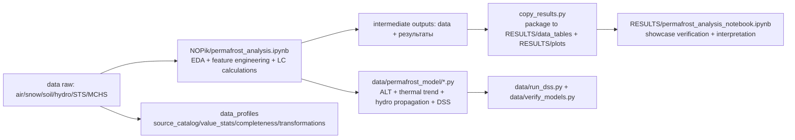

# Ответы на вопросы по README-03-LC-описание-данных

Документ перестроен в формате прямых ответов на вопросы 1-3 с сохранением ранее собранной информации, ссылок на код и витрины данных.

## Вопрос 1. В начале должно быть описание данных и формат описания, а в конце раздела — ссылки на код и ноутбуки

### Ответ 1.1. Описание данных (в начале)

Исходный массив объединяет климатические, гидрологические, мерзлотные и событийные данные, приведенные к единому аналитическому контуру для задач ВКР и поддержки решений МЧС.

1. Пространственный охват: ленский профиль (Киренск, Витим, Ленск, Олёкминск, Покровск, Якутск, Табага, Сангар, Жиганск), целевая точка прогноза — Якутск.
2. Временной охват: для расчетного контура в основном 2008-2023; для СТС/ALT сохранен расширенный годовой ряд 1990-2025.
3. Типы данных: климатические (температура, осадки, снег), гидрологические (уровни воды и пики), геокриологические (СТС/ALT), событийные (архивы ЧС).
4. Уровни агрегирования: день, месяц, год.
5. Назначение: анализ аномалий, лагов и формирование сценариев реагирования.

### Ответ 1.2. Формат описания исходных данных (принят в документе)

Для каждого источника описание выполнено по одинаковой схеме:

1. Какой параметр измеряется и в каких единицах.
2. В каком городе/пункте/посте представлены данные.
3. За какой период доступны наблюдения.
4. Какие графики построены по этим данным.
5. Какие статистические характеристики использованы (уровень, разброс, квантили, экстремумы, z-оценки и пр.).

Ключевой принцип: приоритет у источника данных и статистических характеристик значений, а не у формального списка столбцов.

### Ответ 1.3. Готовое описание исходных данных

### Температура воздуха и осадки

Параметры температуры воздуха и осадков получены из исходного ряда [data/air/wr373144a2/wr373144a2.txt](data/air/wr373144a2/wr373144a2.txt) с суточным шагом. Для расчетного контура использованы станции ленского профиля и контрольные станции, а для сопоставимого анализа аномалий принят период 2008-2023. По этим данным построены суточные и месячные аномальные витрины [RESULTS (Read me, Dara)/data_tables/daily_anomalies_operational.csv](RESULTS%20(Read%20me,%20Dara)/data_tables/daily_anomalies_operational.csv) и [RESULTS (Read me, Dara)/data_tables/monthly_anomalies_operational.csv](RESULTS%20(Read%20me,%20Dara)/data_tables/monthly_anomalies_operational.csv), а также обзорный график аномалий [RESULTS (Read me, Dara)/plots/anomalies_overview.png](RESULTS%20(Read%20me,%20Dara)/plots/anomalies_overview.png). В расчетах используются z-оценки, пороги P95/P99, интегральные баллы risk_points и категория severity, что позволяет одновременно оценивать уровень, разброс и экстремальность температурно-осадочных сигналов.

### Снежный покров

Параметры снежного покрова (высота снега и производные зимние показатели) получены из ряда [data/snow/wr373144a5/wr373144a5.txt](data/snow/wr373144a5/wr373144a5.txt) с суточным шагом. Для анализа принята сквозная сезонная логика зимы (октябрь-апрель) и период сопоставления 2008-2023. На основе этих данных рассчитываются max_snow_depth, winter_thaw_days и ROS-сигналы, которые входят в оперативные и годовые индикаторы риска. Качество и полнота источников зафиксированы в [RESULTS (Read me, Dara)/data_profiles/source_catalog.csv](RESULTS%20(Read%20me,%20Dara)/data_profiles/source_catalog.csv) и [RESULTS (Read me, Dara)/data_profiles/completeness_report.csv](RESULTS%20(Read%20me,%20Dara)/data_profiles/completeness_report.csv).

### Температура грунта

Параметры температуры грунта по глубинам получены из ряда [data/soil/wr373144a3/wr373144a3.txt](data/soil/wr373144a3/wr373144a3.txt) с суточным шагом. Эти данные используются для мерзлотного контура (оценка трендов прогрева, интерпретация устойчивости оснований, калибровка связей с сезонным протаиванием). В визуальной части результаты представлены через графики деградации мерзлоты в папке plots, а в расчетной части включены в сценарный контур через агрегированные показатели. Источник и его атрибуты отражены в [RESULTS (Read me, Dara)/data_profiles/source_catalog.csv](RESULTS%20(Read%20me,%20Dara)/data_profiles/source_catalog.csv).

### Уровни воды по гидропостам Лены

Гидрологические параметры получены из суточных рядов [data/hydro/lena-*.csv](data/hydro) для 9 гидропостов ленского профиля (Киренск, Витим, Ленск, Олёкминск, Покровск, Якутск, Табага, Сангар, Жиганск). Для сопоставимого анализа используется период 2008-2023, а в витрине сформированы [RESULTS (Read me, Dara)/data_tables/water_level_annual_features.csv](RESULTS%20(Read%20me,%20Dara)/data_tables/water_level_annual_features.csv), [RESULTS (Read me, Dara)/data_tables/water_level_monthly_corr.csv](RESULTS%20(Read%20me,%20Dara)/data_tables/water_level_monthly_corr.csv), [RESULTS (Read me, Dara)/data_tables/water_level_peak_lags_yakutsk.csv](RESULTS%20(Read%20me,%20Dara)/data_tables/water_level_peak_lags_yakutsk.csv) и [RESULTS (Read me, Dara)/data_tables/lena_lag.csv](RESULTS%20(Read%20me,%20Dara)/data_tables/lena_lag.csv). Для Якутска в витринной сводке зафиксированы характерные статистики весенних пиков (максимум 854 см, среднее около 648.6 см), а пространственные связи между постами оцениваются корреляционной матрицей и лаговыми характеристиками. Графики: [RESULTS (Read me, Dara)/plots/water_level_spring_peaks.png](RESULTS%20(Read%20me,%20Dara)/plots/water_level_spring_peaks.png) и [RESULTS (Read me, Dara)/plots/water_level_peak_lags_yakutsk.png](RESULTS%20(Read%20me,%20Dara)/plots/water_level_peak_lags_yakutsk.png).

### Глубина сезонного протаивания (СТС/ALT)

Параметры глубины сезонного протаивания получены из исходной таблицы [data/СТС.csv](data/%D0%A1%D0%A2%D0%A1.csv) в широком годовом формате (колонки 1990-2025). На витрине используется [RESULTS (Read me, Dara)/data_tables/СТС.csv](RESULTS%20(Read%20me,%20Dara)/data_tables/%D0%A1%D0%A2%D0%A1.csv). Для этого источника в профилях рассчитаны распределения по каждому году, включая min, p05, median, mean, p95, max, std и IQR: [RESULTS (Read me, Dara)/data_profiles/value_stats_raw.csv](RESULTS%20(Read%20me,%20Dara)/data_profiles/value_stats_raw.csv). Полнота сильно неоднородна по площадкам и отражена в [RESULTS (Read me, Dara)/data_profiles/completeness_report.csv](RESULTS%20(Read%20me,%20Dara)/data_profiles/completeness_report.csv), что учитывается при интерпретации межгодовых трендов и сценарных выводов.

### Архивы чрезвычайных ситуаций (ЧС)

Событийные данные ЧС представлены источниками [data/mchs_events.csv](data/mchs_events.csv) и [data/mchs_events_lena_bank.csv](data/mchs_events_lena_bank.csv) с событийным шагом (дата начала/окончания, тип, локация). В расчетной витрине используются [RESULTS (Read me, Dara)/data_tables/mchs_events.csv](RESULTS%20(Read%20me,%20Dara)/data_tables/mchs_events.csv) и [RESULTS (Read me, Dara)/data_tables/mchs_events_lena_bank.csv](RESULTS%20(Read%20me,%20Dara)/data_tables/mchs_events_lena_bank.csv). По текущей витринной сводке архив включает 79 событий в общей базе и 17 событий для ленской береговой зоны за 2008-2023, что формирует целевую переменную для лагового сопоставления с аномалиями. Годовая событийная полнота отражена в [RESULTS (Read me, Dara)/data_profiles/completeness_report.csv](RESULTS%20(Read%20me,%20Dara)/data_profiles/completeness_report.csv), а связка «аномалия -> ЧС» зафиксирована в [RESULTS (Read me, Dara)/data_tables/anomaly_chs_linked.csv](RESULTS%20(Read%20me,%20Dara)/data_tables/anomaly_chs_linked.csv).

### Ответ 1.4. Ссылки на код и ноутбуки (в конце раздела)

1. [NOPik/permafrost_analysis.ipynb](NOPik/permafrost_analysis.ipynb) — основной расчетный конвейер.
2. [NOPik/LENA_CHS_ANALYSIS.ipynb](NOPik/LENA_CHS_ANALYSIS.ipynb) — дополнительный анализ по ЧС/гидрологии.
3. [RESULTS (Read me, Dara)/reproduction_scripts/copy_results.py](RESULTS%20(Read%20me,%20Dara)/reproduction_scripts/copy_results.py) — упаковка результатов в витрину data_tables/plots.
4. [RESULTS (Read me, Dara)/permafrost_analysis_notebook.ipynb](RESULTS%20(Read%20me,%20Dara)/permafrost_analysis_notebook.ipynb) — проверка и интерпретация витринных таблиц.

## Вопрос 2. Укажите ноутбук, где проведен разведочный анализ данных

Разведочный анализ данных (EDA) выполнен в ноутбуке [NOPik/permafrost_analysis.ipynb](NOPik/permafrost_analysis.ipynb).

## Вопрос 3. Важно не название столбцов, а источник и статистические характеристики значений

Требование выполнено следующим образом:

1. Основной акцент сделан на описание источников, пространственно-временного охвата и качества данных.
2. Для статистических характеристик и полноты введена отдельная витрина профилей:
	[RESULTS (Read me, Dara)/data_profiles/source_catalog.csv](RESULTS%20(Read%20me,%20Dara)/data_profiles/source_catalog.csv),
	[RESULTS (Read me, Dara)/data_profiles/value_stats_raw.csv](RESULTS%20(Read%20me,%20Dara)/data_profiles/value_stats_raw.csv),
	[RESULTS (Read me, Dara)/data_profiles/completeness_report.csv](RESULTS%20(Read%20me,%20Dara)/data_profiles/completeness_report.csv),
	[RESULTS (Read me, Dara)/data_profiles/transformations_log.csv](RESULTS%20(Read%20me,%20Dara)/data_profiles/transformations_log.csv).
3. Списки полей в таблицах сохранены как справочный уровень, но не как основной смысловой уровень описания.

## Вопрос 4. Причина в роли ноутбуков в пайплайне: опишите пайплайн и роли всех ноутбуков и скриптов

Ниже приведен полный рабочий пайплайн проекта с распределением ролей по ноутбукам и скриптам.

### Ответ 4.1. Сквозной пайплайн данных

1. Слой источников (raw): файлы в [data](data) — метеорология air/snow/soil, гидропосты hydro, СТС, архивы ЧС.
2. Слой разведки и формирования признаков: основной ноутбук [NOPik/permafrost_analysis.ipynb](NOPik/permafrost_analysis.ipynb).
3. Слой промежуточных расчетных результатов: таблицы и графики в [результаты](результаты) и [data](data).
4. Слой упаковки в витрину: перенос итоговых таблиц/графиков в [RESULTS (Read me, Dara)/data_tables](RESULTS%20(Read%20me,%20Dara)/data_tables) и [RESULTS (Read me, Dara)/plots](RESULTS%20(Read%20me,%20Dara)/plots) через [RESULTS (Read me, Dara)/reproduction_scripts/copy_results.py](RESULTS%20(Read%20me,%20Dara)/reproduction_scripts/copy_results.py).
5. Слой верификации и интерпретации витрины: [RESULTS (Read me, Dara)/permafrost_analysis_notebook.ipynb](RESULTS%20(Read%20me,%20Dara)/permafrost_analysis_notebook.ipynb).
6. Слой профильной витрины качества источников: [RESULTS (Read me, Dara)/data_profiles](RESULTS%20(Read%20me,%20Dara)/data_profiles).

### Ответ 4.2. Роли всех ноутбуков

1. [NOPik/permafrost_analysis.ipynb](NOPik/permafrost_analysis.ipynb)
	Главный вычислительный ноутбук: парсинг исходных данных, расчет индикаторов, аномалий, лагов, формирование таблиц и части графиков.
2. [NOPik/LENA_CHS_ANALYSIS.ipynb](NOPik/LENA_CHS_ANALYSIS.ipynb)
	Тематический ноутбук по связям ЧС и ленского гидрологического профиля; дополняет основной анализ кейсами по ЧС.
3. [RESULTS (Read me, Dara)/permafrost_analysis_notebook.ipynb](RESULTS%20(Read%20me,%20Dara)/permafrost_analysis_notebook.ipynb)
	Витринный ноутбук: проверка состава data_tables, воспроизведение ключевых итогов и презентационная интерпретация.

### Ответ 4.3. Роли всех скриптов

#### Скрипты в reproduction_scripts

1. [RESULTS (Read me, Dara)/reproduction_scripts/explore_data.py](RESULTS%20(Read%20me,%20Dara)/reproduction_scripts/explore_data.py)
	Первичная разведка структуры исходных файлов.
2. [RESULTS (Read me, Dara)/reproduction_scripts/inspect_columns.py](RESULTS%20(Read%20me,%20Dara)/reproduction_scripts/inspect_columns.py)
	Проверка и унификация колонок/полей.
3. [RESULTS (Read me, Dara)/reproduction_scripts/inspect_anomalies.py](RESULTS%20(Read%20me,%20Dara)/reproduction_scripts/inspect_anomalies.py)
	Диагностика и обзор аномалий/ЧС.
4. [RESULTS (Read me, Dara)/reproduction_scripts/match_alt_stations.py](RESULTS%20(Read%20me,%20Dara)/reproduction_scripts/match_alt_stations.py)
	Сопоставление площадок ALT/СТС со станциями.
5. [RESULTS (Read me, Dara)/reproduction_scripts/inspect_specific_sites.py](RESULTS%20(Read%20me,%20Dara)/reproduction_scripts/inspect_specific_sites.py)
	Локальная проверка выбранных площадок/станций.
6. [RESULTS (Read me, Dara)/reproduction_scripts/inspect_sample_data.py](RESULTS%20(Read%20me,%20Dara)/reproduction_scripts/inspect_sample_data.py)
	Контроль корректности примеров исходных рядов.
7. [RESULTS (Read me, Dara)/reproduction_scripts/inspect_fixed_width.py](RESULTS%20(Read%20me,%20Dara)/reproduction_scripts/inspect_fixed_width.py)
	Проверка fixed-width форматов.
8. [RESULTS (Read me, Dara)/reproduction_scripts/test_fixed_slices.py](RESULTS%20(Read%20me,%20Dara)/reproduction_scripts/test_fixed_slices.py)
	Тестирование правил разреза fixed-width строк.
9. [RESULTS (Read me, Dara)/reproduction_scripts/inspect_met_coverage.py](RESULTS%20(Read%20me,%20Dara)/reproduction_scripts/inspect_met_coverage.py)
	Оценка метеорологического покрытия по станциям/периодам.
10. [RESULTS (Read me, Dara)/reproduction_scripts/read_mes.py](RESULTS%20(Read%20me,%20Dara)/reproduction_scripts/read_mes.py)
	 Утилитарное чтение и разбор вспомогательных текстовых материалов.
11. [RESULTS (Read me, Dara)/reproduction_scripts/train_alt_model.py](RESULTS%20(Read%20me,%20Dara)/reproduction_scripts/train_alt_model.py)
	 Обучение/оценка моделей ALT.
12. [RESULTS (Read me, Dara)/reproduction_scripts/calibrate_stefan.py](RESULTS%20(Read%20me,%20Dara)/reproduction_scripts/calibrate_stefan.py)
	 Калибровка моделей Стефана.
13. [RESULTS (Read me, Dara)/reproduction_scripts/analyze_soil_warming.py](RESULTS%20(Read%20me,%20Dara)/reproduction_scripts/analyze_soil_warming.py)
	 Анализ трендов потепления грунта.
14. [RESULTS (Read me, Dara)/reproduction_scripts/analyze_hydro.py](RESULTS%20(Read%20me,%20Dara)/reproduction_scripts/analyze_hydro.py)
	 Анализ гидропиков и лагов прохождения волны.
15. [RESULTS (Read me, Dara)/reproduction_scripts/inspect_existing_results.py](RESULTS%20(Read%20me,%20Dara)/reproduction_scripts/inspect_existing_results.py)
	 Проверка структуры сформированных результатов.
16. [RESULTS (Read me, Dara)/reproduction_scripts/copy_results.py](RESULTS%20(Read%20me,%20Dara)/reproduction_scripts/copy_results.py)
	 Витринная упаковка: перенос таблиц/графиков в каталог RESULTS.
17. [RESULTS (Read me, Dara)/reproduction_scripts/find_ipynb.py](RESULTS%20(Read%20me,%20Dara)/reproduction_scripts/find_ipynb.py)
	 Служебный поиск ноутбуков для воспроизводимости маршрута анализа.

#### Скрипты в data

1. [data/run_dss.py](data/run_dss.py)
	Интерактивный запуск DSS-сценариев на основе рассчитанных моделей.
2. [data/verify_models.py](data/verify_models.py)
	Проверка корректности модельных расчетов и тестовые проверки.
3. [data/generate_plots.py](data/generate_plots.py)
	Генерация визуализаций по расчетным данным.

#### Модульное ядро моделей

1. [data/permafrost_model/alt_solver.py](data/permafrost_model/alt_solver.py)
2. [data/permafrost_model/thermal_trend.py](data/permafrost_model/thermal_trend.py)
3. [data/permafrost_model/hydro_propagation.py](data/permafrost_model/hydro_propagation.py)
4. [data/permafrost_model/dss.py](data/permafrost_model/dss.py)

Эти модули реализуют математические функции, которые вызываются в сценарных и аналитических скриптах.

## Приложение A. LC-метод и детальные таблицы

## A1. Что такое LC-метод в данном проекте

LC-метод (Lead-Lag Correlation) в рамках проекта используется как единый язык для анализа связей:

1. Гидрологический контур: как сигнал по уровню воды на верхних постах Лены сдвигается во времени и проявляется на нижних постах.
2. Климато-событийный контур: как климатические аномалии (в том же году или с лагом N -> N+1) связаны с вероятностью ЧС.

Базовая функция кросс-корреляции:

$$
R_{xy}(k)=\frac{\sum_t(x_t-\bar x)(y_{t+k}-\bar y)}{\sqrt{\sum_t(x_t-\bar x)^2\sum_t(y_{t+k}-\bar y)^2}}
$$

где:

1. $x_t$ — предиктор (верхний гидропост, климатический индекс, аномальный сигнал).
2. $y_t$ — отклик (уровень воды в целевом створе, факт ЧС, класс сценария).
3. $k$ — лаг в днях/месяцах/годах.
4. $k>0$ означает, что предиктор опережает отклик и может использоваться для упреждения.

Оптимальный лаг:

$$
k_{opt}=\arg\max_k R_{xy}(k)
$$

## A2. Исследовательская логика (данные -> LC -> управленческий вывод)

Проект формирует причинно-операционную цепочку:

1. Климатические сигналы (Tmean, осадки, снег, оттепели) ->
2. Гидрологический отклик и изменение мерзлотных индикаторов ->
3. Связь с фактами ЧС ->
4. Сценарный класс года ->
5. Рекомендации для реагирования.

В терминах LC это означает, что каждый шаг проверяется через временной сдвиг и силу связи, а не только через одновременную корреляцию.

## A3. Пространственно-временная рамка данных

### 3.1 Пространство

Профиль р. Лены в таблицах результатов покрывает 9 постов:

1. Киренск
2. Витим
3. Ленск
4. Олёкминск
5. Покровск
6. Якутск
7. Табага
8. Сангар
9. Жиганск

Целевая точка оперативного прогноза в большинстве расчетов — Якутск.

### 3.2 Время

1. Для годовых и лаговых гидрологических таблиц в RESULTS используется период 2008-2023 (16 лет).
2. Для суточной оперативной аномалистики (daily) доступно 3095 строк, что соответствует многолетнему ряду с пропусками/фильтрацией по станциям.
3. Для месячной оперативной аномалистики (monthly) — 163 строки.
4. Для CALM/СТС в файле СТС.csv доступны колонки 1990-2025 (по площадкам и регионам).

## A4. Состав данных в RESULTS/data_tables и роль в LC-анализе

Для статистических характеристик исходных значений и полноты используйте витрину профилей:

1. [RESULTS (Read me, Dara)/data_profiles/source_catalog.csv](RESULTS%20(Read%20me,%20Dara)/data_profiles/source_catalog.csv) — паспорт источников.
2. [RESULTS (Read me, Dara)/data_profiles/value_stats_raw.csv](RESULTS%20(Read%20me,%20Dara)/data_profiles/value_stats_raw.csv) — распределения и разброс по исходным параметрам.
3. [RESULTS (Read me, Dara)/data_profiles/completeness_report.csv](RESULTS%20(Read%20me,%20Dara)/data_profiles/completeness_report.csv) — полнота по годам/площадкам.
4. [RESULTS (Read me, Dara)/data_profiles/transformations_log.csv](RESULTS%20(Read%20me,%20Dara)/data_profiles/transformations_log.csv) — журнал преобразований source -> data_tables.

## A4.1 Файлы оперативной аномалистики (вход в LC климат->ЧС)

### daily_anomalies_operational.csv (3095 строк)

Формируется в: [NOPik/permafrost_analysis.ipynb](NOPik/permafrost_analysis.ipynb). Витринный перенос в data_tables: [RESULTS (Read me, Dara)/reproduction_scripts/copy_results.py](RESULTS%20(Read%20me,%20Dara)/reproduction_scripts/copy_results.py).

Статистические характеристики исходных значений (до агрегирования в витрину) см. в [RESULTS (Read me, Dara)/data_profiles/value_stats_raw.csv](RESULTS%20(Read%20me,%20Dara)/data_profiles/value_stats_raw.csv) и полноту по времени в [RESULTS (Read me, Dara)/data_profiles/completeness_report.csv](RESULTS%20(Read%20me,%20Dara)/data_profiles/completeness_report.csv).

Поля:

date, year, month, station_id, station_name, tmean, tmean_norm, tmean_z, precip_mm, precip_p95, delta_tmean_1d, signals, triggered_parameters, risk_points, severity.

Роль в LC:

1. Формирует краткосрочные предикторы $x_t$ на уровне дня.
2. Дает возможность оценивать лаги «аномальный день -> событие ЧС» в окнах типа -3..+3 дня.
3. risk_points и severity могут использоваться как интегральные дискретные сигналы для бинарной/порядковой LC-оценки.

### monthly_anomalies_operational.csv (163 строки)

Формируется в: [NOPik/permafrost_analysis.ipynb](NOPik/permafrost_analysis.ipynb). Витринный перенос в data_tables: [RESULTS (Read me, Dara)/reproduction_scripts/copy_results.py](RESULTS%20(Read%20me,%20Dara)/reproduction_scripts/copy_results.py).

Статистические характеристики исходных значений (до агрегирования в витрину) см. в [RESULTS (Read me, Dara)/data_profiles/value_stats_raw.csv](RESULTS%20(Read%20me,%20Dara)/data_profiles/value_stats_raw.csv) и полноту по времени в [RESULTS (Read me, Dara)/data_profiles/completeness_report.csv](RESULTS%20(Read%20me,%20Dara)/data_profiles/completeness_report.csv).

Поля:

period, year, month, station_id, station_name, tmean_month, tmean_z, precip_month, precip_z, winter_thaw_days, winter_thaw_z, max_daily_precip, signals, triggered_parameters, risk_points, severity.

Роль в LC:

1. Формирует сглаженные месячные предикторы для межсезонной связи.
2. Используется для лагов «аномальный месяц -> рост риска ЧС в последующие месяцы/сезон».

## A4.2 Файлы событий ЧС (целевая переменная в LC)

### mchs_events.csv (79 строк)

Формируется в: [NOPik/permafrost_analysis.ipynb](NOPik/permafrost_analysis.ipynb) (конвертация и фильтрация XLS-архива ЧС). Витринный перенос в data_tables: [RESULTS (Read me, Dara)/reproduction_scripts/copy_results.py](RESULTS%20(Read%20me,%20Dara)/reproduction_scripts/copy_results.py).

Статистический профиль событий и годовая полнота см. в [RESULTS (Read me, Dara)/data_profiles/value_stats_raw.csv](RESULTS%20(Read%20me,%20Dara)/data_profiles/value_stats_raw.csv) и [RESULTS (Read me, Dara)/data_profiles/completeness_report.csv](RESULTS%20(Read%20me,%20Dara)/data_profiles/completeness_report.csv).

Поля:

date_start, date_end, type_chs, location, region, season_type, damage_rub.

Роль в LC:

1. Базовый реестр фактов ЧС для связки с аномалиями.
2. Может кодироваться как бинарный ряд (0/1), счетчик событий, либо взвешенный по damage_rub отклик $y_t$.

### mchs_events_lena_bank.csv (17 строк)

Формируется в: [NOPik/permafrost_analysis.ipynb](NOPik/permafrost_analysis.ipynb) (фильтр «берег Лены» по событиям ЧС). Витринный перенос в data_tables: [RESULTS (Read me, Dara)/reproduction_scripts/copy_results.py](RESULTS%20(Read%20me,%20Dara)/reproduction_scripts/copy_results.py).

Статистический профиль событий и годовая полнота см. в [RESULTS (Read me, Dara)/data_profiles/value_stats_raw.csv](RESULTS%20(Read%20me,%20Dara)/data_profiles/value_stats_raw.csv) и [RESULTS (Read me, Dara)/data_profiles/completeness_report.csv](RESULTS%20(Read%20me,%20Dara)/data_profiles/completeness_report.csv).

Поля:

date_start, date_end, type_chs, location, region, season_type, damage_rub, year, month.

Роль в LC:

1. Специализированная подвыборка по ленскому профилю.
2. Удобна для прямой стыковки с гидропостами и месячной аномалистикой.

### anomaly_chs_linked.csv (5 строк)

Формируется в: [NOPik/permafrost_analysis.ipynb](NOPik/permafrost_analysis.ipynb) (увязка аномалий с ЧС в лаговых окнах). Витринный перенос в data_tables: [RESULTS (Read me, Dara)/reproduction_scripts/copy_results.py](RESULTS%20(Read%20me,%20Dara)/reproduction_scripts/copy_results.py).

Поля:

дата_аномалии, год, тип_аномалии, была_ли_ЧС, тип_ЧС, НП, лаг_дней, окно, ущерб_руб.

Роль в LC:

1. Итоговая таблица ручной/полуавтоматической увязки «аномалия -> ЧС».
2. лаг_дней и окно уже содержат готовую интерпретацию lead-lag связи.
3. Может использоваться как обучающая/контрольная выборка для проверки правил сопоставления.

## A4.3 Файлы гидрологического контура LC

### water_level_annual_features.csv (144 строки)

Формируется в: [NOPik/permafrost_analysis.ipynb](NOPik/permafrost_analysis.ipynb) (блок анализа гидропостов, расчет годовых признаков). Витринный перенос в data_tables: [RESULTS (Read me, Dara)/reproduction_scripts/copy_results.py](RESULTS%20(Read%20me,%20Dara)/reproduction_scripts/copy_results.py).

Распределения исходных уровней воды и полнота суточных рядов по годам см. в [RESULTS (Read me, Dara)/data_profiles/value_stats_raw.csv](RESULTS%20(Read%20me,%20Dara)/data_profiles/value_stats_raw.csv) и [RESULTS (Read me, Dara)/data_profiles/completeness_report.csv](RESULTS%20(Read%20me,%20Dara)/data_profiles/completeness_report.csv).

Поля:

post, year, annual_peak_cm, annual_peak_date, spring_peak_cm, spring_peak_date, spring_min_cm, spring_amplitude_cm, max_rise_7d_cm_day, max_fall_7d_cm_day, rise_start_date, days_from_rise_to_peak, days_above_p90, days_above_p95, p90_level_cm, p95_level_cm, annual_peak_cm_z, spring_peak_cm_z, spring_amplitude_cm_z, max_rise_7d_cm_day_z, days_above_p90_z, days_above_p95_z.

Роль в LC:

1. Формирует стандартизированные признаки волны половодья по каждому посту.
2. Позволяет анализировать лаги по пикам, скорости подъема и длительности превышений порогов.
3. Z-нормированные колонки удобны для сопоставления между постами с разными абсолютными уровнями.

### water_level_peak_lags_yakutsk.csv (16 строк)

Формируется в: [NOPik/permafrost_analysis.ipynb](NOPik/permafrost_analysis.ipynb) как лаговая таблица относительно Якутска; в выгрузке также используется вариант имени с кириллицей. Витринный перенос в data_tables: [RESULTS (Read me, Dara)/reproduction_scripts/copy_results.py](RESULTS%20(Read%20me,%20Dara)/reproduction_scripts/copy_results.py).

Поля:

year, лаг пика Витим→Якутск, дней, лаг пика Жиганск→Якутск, дней, лаг пика Киренск→Якутск, дней, лаг пика Ленск→Якутск, дней, лаг пика Олёкминск→Якутск, дней, лаг пика Покровск→Якутск, дней, лаг пика Сангар→Якутск, дней, лаг пика Табага→Якутск, дней.

Роль в LC:

1. Готовая сводка оптимальных лагов добегания пика относительно Якутска.
2. Основа для упреждающего окна реагирования МЧС (обычно 3-5 суток для критичных участков).

### water_level_peak_lags_якутск.csv (16 строк)

Формируется в: [NOPik/permafrost_analysis.ipynb](NOPik/permafrost_analysis.ipynb) (тот же расчет лагов, вариант имени файла). Витринный перенос в data_tables: [RESULTS (Read me, Dara)/reproduction_scripts/copy_results.py](RESULTS%20(Read%20me,%20Dara)/reproduction_scripts/copy_results.py).

Содержательно дублирует предыдущую таблицу (вариант имени файла в кириллице).

Роль в LC:

1. Резервная копия/альтернативная версия выгрузки.
2. При автоматизации стоит выбрать один канонический файл, чтобы избежать двойного учета.

### water_level_monthly_corr.csv (9 строк)

Формируется в: [NOPik/permafrost_analysis.ipynb](NOPik/permafrost_analysis.ipynb) (корреляция среднемесячных уровней между постами). Витринный перенос в data_tables: [RESULTS (Read me, Dara)/reproduction_scripts/copy_results.py](RESULTS%20(Read%20me,%20Dara)/reproduction_scripts/copy_results.py).

Поля:

post, Киренск, Витим, Ленск, Олёкминск, Покровск, Якутск, Табага, Сангар, Жиганск.

Роль в LC:

1. Матрица пространственной связности (нулевой лаг/агрегированный лаг).
2. Предварительный фильтр: пары с низкой связью не следует использовать как основные предикторы в LC-прогнозе.

### lena_lag.csv (16 строк)

Формируется в: [NOPik/permafrost_analysis.ipynb](NOPik/permafrost_analysis.ipynb) (лаги по датам оттепели/пиков относительно Якутска). Витринный перенос в data_tables: [RESULTS (Read me, Dara)/reproduction_scripts/copy_results.py](RESULTS%20(Read%20me,%20Dara)/reproduction_scripts/copy_results.py).

Поля:

H1, лаг Киренск→Якутск, лаг Олёкминск→Якутск, лаг Жиганск→Якутск.

Роль в LC:

1. Компактная оперативная лаг-таблица по ключевым створам.
2. Подходит для прямой вставки в регламент оповещения.

## A4.4 Годовые сценарные и мерзлотные таблицы

### scenario_annual.csv (16 строк)

Формируется в: [NOPik/permafrost_analysis.ipynb](NOPik/permafrost_analysis.ipynb) (годовые индексы и сценарная классификация). Витринный перенос в data_tables: [RESULTS (Read me, Dara)/reproduction_scripts/copy_results.py](RESULTS%20(Read%20me,%20Dara)/reproduction_scripts/copy_results.py).

Поля:

year, TDD, TDD_z, FDD, FDD_z, thaw_d, n_moderate, n_extreme, сценарий, меры_реагирования.

Роль в LC:

1. Интегратор климатических сигналов по году.
2. Используется для межгодовой связи N -> N+1 (например, аномальный год N как предиктор роста риска ЧС в N+1).

### СТС.csv (83 строки)

Источник: [data/СТС.csv](data/%D0%A1%D0%A2%D0%A1.csv). В data_tables файл переносится напрямую скриптом [RESULTS (Read me, Dara)/reproduction_scripts/copy_results.py](RESULTS%20(Read%20me,%20Dara)/reproduction_scripts/copy_results.py) без пересчета.

Статистика значений по годовым колонкам и полнота по площадкам см. в [RESULTS (Read me, Dara)/data_profiles/value_stats_raw.csv](RESULTS%20(Read%20me,%20Dara)/data_profiles/value_stats_raw.csv) и [RESULTS (Read me, Dara)/data_profiles/completeness_report.csv](RESULTS%20(Read%20me,%20Dara)/data_profiles/completeness_report.csv).

Поля:

Site Code, Region, Site Name, LAT, LONG, Method, 1990..2025.

Роль в LC:

1. Источник по глубине сезонного протаивания (ALT/СТС) для мерзлотного контура.
2. Дает медленный компонент системы, который связывается с климатом и инфраструктурной уязвимостью через годовые лаги.

## A5. LC-дизайн: какие пары переменных строить на этих данных

Ниже рекомендуемые пары для расчета LC-кривых по уже доступным таблицам RESULTS.

### 5.1 Гидрологические LC-пары (дни)

1. $x_t$: spring_peak_cm или max_rise_7d_cm_day на постах Ленск/Олёкминск/Витим.
2. $y_t$: spring_peak_cm (или факт превышения порога) в Якутске.
3. Ожидаемые лаги: около 3-5 суток для центрального участка, с вариацией по году.

### 5.2 Климато-событийные LC-пары (дни/месяцы)

1. $x_t$: risk_points и severity из daily/monthly.
2. $y_t$: индикатор ЧС (есть/нет), тип ЧС, damage_rub.
3. Окна: быстрые процессы -3..+3 дня; более инерционные до +14 дней.

### 5.3 Межгодовые LC-пары (годы)

1. $x_y$: TDD_z, FDD_z, thaw_d, n_extreme из scenario_annual.
2. $y_{y+1}$: число/тяжесть ЧС за следующий год.
3. Интерпретация: если пик $R_{xy}(k)$ при $k=+1$, значит климатический фон года N опережает событийный рост в N+1.

## A6. Минимальные требования к предобработке перед LC-расчетом

1. Синхронизировать календарь: единый формат дат, единый часовой пояс, отсутствие дубликатов.
2. Для зимних индикаторов использовать «сквозной сезон» (ноябрь-декабрь предыдущего года + январь-апрель текущего).
3. Удалять или маркировать пропуски до корреляции; не смешивать интерполяцию и фактические наблюдения без флага качества.
4. Приводить ряды к сопоставимой шкале (z-нормировка или ранги), если сравниваются разные посты/параметры.
5. Проверять устойчивость лага по годам: не только средний лаг, но и разброс/квантили.

## A7. Ограничения данных, важные для интерпретации LC

1. Небольшая длина ряда по ключевым годовым лагам (16 лет) ограничивает статистическую мощность для сложных моделей.
2. Таблица anomaly_chs_linked.csv очень компактна (5 строк) и подходит скорее для иллюстрации/кейс-анализа.
3. Для water_level_peak_lags есть дублирование файла (латиница/кириллица в имени).
4. В событийных таблицах полезно дополнительно унифицировать справочник типов ЧС (синонимы, регистр, орфография).
5. Для ущерба damage_rub целесообразно использовать лог-шкалу при корреляционном анализе из-за тяжелого хвоста распределения.

## A8. Как читать LC-результат в терминах управления

1. Если $k_{opt}>0$ и связь устойчива, параметр можно использовать как ранний индикатор и формировать окно упреждения.
2. Если лаг плавает между годами, нужен адаптивный прогноз с доверительным интервалом, а не фиксированное число дней.
3. Если связь сильна только в отдельных типах сезонов (например, при высоком снегозапасе), следует вводить условные сценарии, а не единую универсальную формулу.

## A9. Готовое описание для вставки в ВКР (краткая версия)

В исследовании применен LC-метод для оценки временных сдвигов между природными предикторами и целевыми событиями риска. В гидрологическом контуре в качестве предикторов использованы признаки половодья на верхних постах Лены, а целевой переменной — уровни и пики в Якутске; это дало практические лаги упреждения порядка нескольких суток. В климато-событийном контуре использованы суточные и месячные аномальные сигналы (температура, осадки, зимние оттепели, интегральные баллы риска), которые сопоставлены с архивом ЧС по окнам быстрого и инерционного отклика. На межгодовом уровне применено сопоставление годовых индексов TDD/FDD/частоты аномалий со сценариями и событиями следующего года. Такой дизайн позволяет перевести статистическую lead-lag связь в регламентируемое окно предупреждения и набор мер реагирования.

## A10. Где находятся исходные материалы

1. RESULTS (Read me, Dara)/README-01.md — методическая база и формулы.
2. RESULTS (Read me, Dara)/data_tables/*.csv — расчетные таблицы для LC-связей.
3. RESULTS (Read me, Dara)/README-00.md и README-02.md — контекст архитектуры, результатов и управленческой интерпретации.
4. RESULTS (Read me, Dara)/README-04.md — публикационное обоснование причинно-следственной цепочки.
5. RESULTS (Read me, Dara)/data_profiles/*.csv — паспорт источников, статистические характеристики и полнота исходных данных.

## Приложение B. Где выполнен анализ (код и ноутбуки)

Разведочный анализ данных (EDA) выполнен в ноутбуке [NOPik/permafrost_analysis.ipynb](NOPik/permafrost_analysis.ipynb).

### 11.1 Основные ноутбуки анализа

1. [NOPik/permafrost_analysis.ipynb](NOPik/permafrost_analysis.ipynb) — основной вычислительный конвейер: парсинг исходных данных из data, расчет индикаторов, аномалий, лагов и экспорт CSV в результаты.
2. [NOPik/LENA_CHS_ANALYSIS.ipynb](NOPik/LENA_CHS_ANALYSIS.ipynb) — дополнительный анализ ЧС и гидрологических связей по ленскому профилю.
3. [RESULTS (Read me, Dara)/permafrost_analysis_notebook.ipynb](RESULTS%20(Read%20me,%20Dara)/permafrost_analysis_notebook.ipynb) — витринный ноутбук проверки и интерпретации уже сформированных таблиц из data_tables.

### 11.2 Ключевые скрипты воспроизведения

1. [RESULTS (Read me, Dara)/reproduction_scripts/analyze_hydro.py](RESULTS%20(Read%20me,%20Dara)/reproduction_scripts/analyze_hydro.py) — расчет пиков половодья и лагов добегания волны.
2. [RESULTS (Read me, Dara)/reproduction_scripts/inspect_anomalies.py](RESULTS%20(Read%20me,%20Dara)/reproduction_scripts/inspect_anomalies.py) — проверка и сводка аномалий и ЧС.
3. [RESULTS (Read me, Dara)/reproduction_scripts/copy_results.py](RESULTS%20(Read%20me,%20Dara)/reproduction_scripts/copy_results.py) — перенос расчетных CSV в data_tables и графиков в plots.
4. [RESULTS (Read me, Dara)/reproduction_scripts/inspect_existing_results.py](RESULTS%20(Read%20me,%20Dara)/reproduction_scripts/inspect_existing_results.py) — контроль структуры итоговых CSV.

### 11.3 Модульный код моделей

1. [data/permafrost_model/alt_solver.py](data/permafrost_model/alt_solver.py) — модели ALT (Стефан, гибрид, регрессия).
2. [data/permafrost_model/hydro_propagation.py](data/permafrost_model/hydro_propagation.py) — лаги и прогнозные связи гидроволны.
3. [data/permafrost_model/thermal_trend.py](data/permafrost_model/thermal_trend.py) — тренд потепления мерзлоты.
4. [data/permafrost_model/dss.py](data/permafrost_model/dss.py) — расчет риск-уровней DSS.
5. [data/run_dss.py](data/run_dss.py) — интеграционный скрипт сценарного применения моделей.

## Приложение C. Отчет о выполненных работах

Ниже приведен отчет о доработках, выполненных в рамках подготовки описания данных и витрины результатов.

### 12.1 Что изменено в этом документе

1. Добавлен вводный блок «Описание данных» с акцентом на источник, охват, типы и назначение данных.
2. Добавлен раздел «Формат описания данных (шаблон для ВКР)» с методикой описания параметров, периода, графиков и статистик.
3. Добавлен раздел «Описание исходных данных: как описывать в тексте главы» с практическим шаблоном абзаца для ВКР.
4. Усилен приоритет: статистические характеристики значений и качество источников важнее формального перечня колонок.
5. Для каждого ключевого CSV в разделе 4 добавлены ссылки:
	где таблица формируется,
	где выполняется витринный перенос,
	где смотреть статистику значений и полноту.
6. Добавлен раздел со ссылками на ноутбуки и код, включая явное указание EDA-ноутбука.

### 12.2 Что создано на витрине data_profiles

Создана витрина профилирования исходных данных:
[RESULTS (Read me, Dara)/data_profiles](RESULTS%20(Read%20me,%20Dara)/data_profiles)

Сформированы первые отчеты:

1. [RESULTS (Read me, Dara)/data_profiles/source_catalog.csv](RESULTS%20(Read%20me,%20Dara)/data_profiles/source_catalog.csv) — 7 строк.
	Содержит паспорт источников: группа, путь, формат, шаг времени, география, параметры, единицы, примечания.
2. [RESULTS (Read me, Dara)/data_profiles/value_stats_raw.csv](RESULTS%20(Read%20me,%20Dara)/data_profiles/value_stats_raw.csv) — 36 строк.
	Содержит статистики по исходным числовым значениям: n_non_null, n_null, min, p05, median, mean, p95, max, std, iqr.
3. [RESULTS (Read me, Dara)/data_profiles/completeness_report.csv](RESULTS%20(Read%20me,%20Dara)/data_profiles/completeness_report.csv) — 122 строки.
	Содержит первичную оценку полноты: по годам для гидропостов, по площадкам/годовым колонкам для СТС, и count-only по годам для ЧС.
4. [RESULTS (Read me, Dara)/data_profiles/transformations_log.csv](RESULTS%20(Read%20me,%20Dara)/data_profiles/transformations_log.csv) — 12 строк.
	Содержит трассировку преобразований source -> data_tables с привязкой к реализации в коде.

### 12.3 Карта происхождения данных (зафиксированная в отчете)

1. Основной расчетный конвейер: [NOPik/permafrost_analysis.ipynb](NOPik/permafrost_analysis.ipynb).
2. Упаковка результатов в витрину data_tables/plots: [RESULTS (Read me, Dara)/reproduction_scripts/copy_results.py](RESULTS%20(Read%20me,%20Dara)/reproduction_scripts/copy_results.py).
3. Проверка и обзор итоговых таблиц: [RESULTS (Read me, Dara)/permafrost_analysis_notebook.ipynb](RESULTS%20(Read%20me,%20Dara)/permafrost_analysis_notebook.ipynb).

### 12.4 Ограничения текущей версии профилей

1. Текущий value_stats_raw ориентирован на исходные CSV-источники и широкую таблицу СТС; fixed-width ряды air/snow/soil пока не профилированы в этом отчете как отдельные числовые панели.
2. Отчет completeness_report для событийных данных ЧС дан в формате count-only по годам (без нормативного expected_count).
3. Профили являются первым проходом витрины и предназначены как базовый уровень доказуемости источников и качества данных для текста ВКР.

### 12.5 Практическая ценность выполненных доработок

1. Раздел теперь отвечает на вопрос «что это за данные и насколько они качественные», а не только «как названы столбцы».
2. В тексте есть прямые ссылки на код формирования каждой ключевой таблицы.
3. Витрина data_profiles добавляет воспроизводимые доказательства: происхождение, статистику значений и полноту исходных данных.
