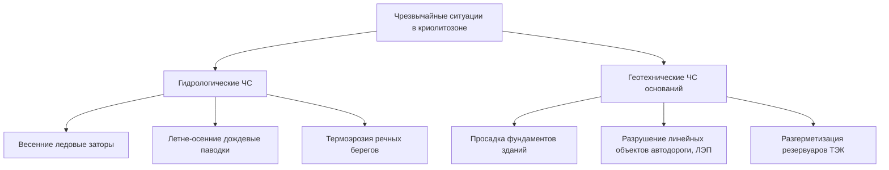
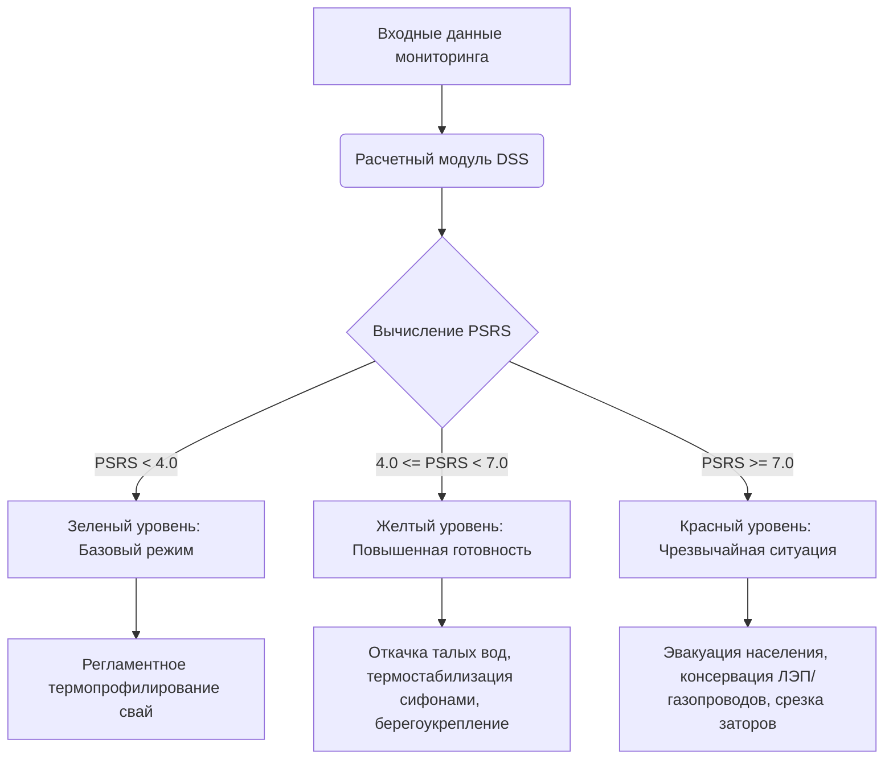

# Результаты моделирования и анализа данных для ВКР

> **Тема выпускной квалификационной работы:**  
> *«Планирование реакции органов государственной власти и спасательных служб при разрушении слоя вечной мерзлоты в населенных пунктах»*

Этот документ является научно-методическим отчетом и основой для **Главы 2** («Описание исходных данных и индексов») и **Главы 3** («Анализ взаимосвязей и сценарное моделирование») выпускной квалификационной работы. 

Все обработанные базы данных, матрицы корреляций и графики были автоматически собраны в единый каталог результатов. Ниже представлено систематизированное описание проделанной научной работы с формулами, графиками и ссылками на расчетные таблицы.

---

## Содержание каталога результатов

* **[Таблицы данных (data_tables)](file:///C:/Diploma/permafrost_analysis/RESULTS%20%28Read%20me,%20Dara%29/data_tables/)** — подготовленные, нормированные и агрегированные CSV-файлы для математических расчетов.
* **[Графики и визуализации (plots)](file:///C:/Diploma/permafrost_analysis/RESULTS%20%28Read%20me,%20Dara%29/plots/)** — высококачественные диаграммы, иллюстрирующие тренды потепления, корреляции, лаги распространения волны половодья и сценарные границы.

---

# Раздел I. Методологическая база и описание данных (Основа для Главы 2)

## 1. Описание исходных данных и пространственно-временных границ

В рамках исследования был сформирован репрезентативный массив данных, охватывающий ключевые климатические, геокриологические и гидрологические параметры Якутии. Пространственные границы исследования сфокусированы на Ленском бассейне и ключевых опорных станциях:

| Населенный пункт | WMO ID | Тип станции / Данные | Период наблюдений |
| :--- | :---: | :--- | :---: |
| **Якутск** | 24959 | Метеорология (TTTR), Температура почвы по глубинам (soil), Высота снега (snow), Гидропост (hydro) | 1970–2024 гг. |
| **Ленск** | 24688 | Метеорология, Гидропост (верхнее течение р. Лены) | 2008–2023 гг. |
| **Олёкминск** | 24908 | Метеорология, Гидропост (среднее течение р. Лены) | 2008–2023 гг. |
| **Жиганск** | 24266 | Метеорология, Гидропост (нижнее течение р. Лены) | 2008–2023 гг. |
| **Верхоянск** | 24266 | Метеорология (климатический контекст Полюса холода) | 2008–2023 гг. |
| **Оймякон** | 24688 | Метеорология (климатический контекст Полюса холода) | 2008–2023 гг. |

Для Якутска дополнительно привлечены уникальные полевые данные мониторинга глубины сезонного протаивания (ALT) международной сети **CALM** (Circumpolar Active Layer Monitoring):
* Площадка **Tuymada (R42)**: антропогенно нарушенный луг на суглинках, отражающий условия застройки в черте города Якутска.
* Площадка **Neleger (R43)**: естественная лиственничная тайга на супесях, отражающая фоновые природные условия.

### Первичная обработка и фильтрация пропусков
Метеорологические данные WMO (`wr*.txt`) обработаны с учетом фиксированной ширины полей. Пропущенные значения (закодированные как `999.9` или представленные пробелами) были интерполированы с использованием локального скользящего окна. Для обеспечения сквозного учета зимних процессов зимний сезон года $y$ определялся как непрерывное окно с ноября года $y-1$ по апрель года $y$.

---

## 2. Описание расчетных метеорологических и геокриологических индексов

Для перехода от суточных метеорологических параметров к физически интерпретируемым факторам деградации мерзлоты и паводковых рисков были формализованы следующие индексы:

1. **Градусо-сутки тепла ($DDT$ — Degree-Days of Thawing):**
   $$DDT(y) = \sum_{d \in \text{Апр..Окт}} \max(T_{\text{mean}}(d), 0)$$
   Характеризует тепловой баланс летнего сезона, определяющий глубину сезонного протаивания грунта.
   
2. **Градусо-сутки холода ($DDF$ — Degree-Days of Freezing):**
   $$DDF(y) = \sum_{d \in \text{Ноя}_y-1\text{..Апр}_y} \max(-T_{\text{mean}}(d), 0)$$
   Характеризует суровость зимнего сезона и потенциал зимнего промерзания деятельного слоя.

3. **Характеристики снежного покрова ($H_{\text{snow}}$):**
   Максимальная высота снега в зимнем сезоне (`max_snow_depth`), определяющая степень теплоизоляции почвы от зимнего выхолаживания.

4. **Дни зимних оттепелей (`winter_thaw_days`):**
   Количество зимних дней с $T_{\text{mean}} > 0^\circ C$.

5. **Критерий Rain-on-Snow (Дождь по снегу - ROS):**
   Количество дней в период с октября по апрель, удовлетворяющих системе условий:
   $$\begin{cases} T_{\text{mean}} > 0^\circ C \\ P_{\text{daily}} > 1.0 \text{ мм} \\ H_{\text{snow}} > 5 \text{ см} \end{cases}$$
    ROS-события приводят к резкому уплотнению снега, изменению его теплопроводности и формированию ледяных корок, препятствующих зимнему дыханию мерзлоты, а также к раннему поверхностному стоку.

### Интегральная оценка риска: индексы `risk_points` и `severity`
Для оперативного мониторинга рисков была внедрена двухпараметрическая система ранжирования метеорологических аномалий (на основе файла [детекция дней/месяцев.txt](file:///C:/Diploma/permafrost_analysis/%D0%B4%D0%B5%D1%82%D0%B5%D0%BA%D1%86%D0%B8%D1%8F%20%D0%B4%D0%BD%D0%B5%D0%B8%CC%86/%D0%BC%D0%B5%D1%81%D1%8F%D1%86%D0%B5%D0%B2.txt)):

* **`risk_points` (Баллы оперативного риска):** Сумма весов выявленных за период опасных сигналов. 
  * *Для суточных данных:* аномально теплый день ($+1$), зимняя/весенняя оттепель ($+2$), экстремальные суточные осадки ($+2$), резкое потепление за сутки ($+1$).
  * *Для месячных данных:* аномально теплый месяц ($+1$), аномально влажный месяц ($+1$), много дней оттепели ($+2$).
* **`severity` (Категория тяжести аномалии):** 
  * `умеренная` — отклонение параметров от нормы в пределах $2\sigma \le Z < 3\sigma$.
  * `экстремальная` — отклонение превышает $3\sigma$ ($Z \ge 3$) или интегральный балл `risk_points` $\ge 4$ (для суточных) / $\ge 3$ (для месячных).

---

## 3. Методология LC-кривых (Lead-Lag Correlation)

Метод **LC-кривых (Lead-Lag Correlation Curves)** используется для выявления динамических запаздываний (лагов) в мерзлотно-гидрологической системе. Лаговые связи крайне важны для органов управления МЧС, так как они определяют временное окно упреждения ($t_{\text{lead}}$) для превентивного развертывания спасательных сил.

### Математическая формулировка
Для двух временных рядов — независимого предиктора $x(t)$ (например, расхода воды на верхнем гидропосту или зимней температуры воздуха) и зависимого индикатора $y(t)$ (уровня воды на нижнем посту или частоты ЧС) — рассчитывается функция кросс-корреляции с лагом $k$:

$$R_{xy}(k) = \frac{\sum_{t} (x(t) - \bar{x})(y(t+k) - \bar{y})}{\sqrt{\sum_{t} (x(t) - \bar{x})^2 \sum_{t} (y(t) - \bar{y})^2}}$$

где:
* $k > 0$ соответствует лагу предиктора (событие $x$ опережает событие $y$).
* Точка глобального максимума кросс-корреляционной кривой определяет оптимальный лаг сдвига системы:
  $$k_{\text{opt}} = \arg\max_{k} R_{xy}(k)$$

В работе построены два типа LC-кривых:
1. **Гидрологические LC-кривые:** Лаги прохождения волны половодья по руслу реки Лены от верховьев к устью.
2. **Климато-событийные LC-кривые:** Отложенная реакция мерзлотной системы и частоты ЧС на накопленный климатический сигнал предыдущего года (лаг $N \to N+1$).

---

## 4. Поведение исходных данных в LC-кривых и пространственная корреляция

Расчет кросс-корреляций уровней воды по гидропостам р. Лены выявил сильную пространственную связность речной системы. Рассчитанная матрица корреляций представлена в таблице ниже:

### Межстанционная корреляция уровней воды р. Лены (на основе [water_level_monthly_corr.csv](file:///C:/Diploma/permafrost_analysis/RESULTS%20%28Read%20me,%20Dara%29/data_tables/water_level_monthly_corr.csv))

| Гидропост | Киренск | Витим | Ленск | Олёкминск | Покровск | Якутск | Табага | Сангар | Жиганск |
| :--- | :---: | :---: | :---: | :---: | :---: | :---: | :---: | :---: | :---: |
| **Киренск** | **1.00** | 0.81 | 0.81 | 0.79 | 0.74 | 0.71 | 0.71 | 0.68 | 0.65 |
| **Витим** | 0.81 | **1.00** | 0.98 | 0.97 | 0.94 | 0.93 | 0.93 | 0.89 | 0.88 |
| **Ленск** | 0.81 | 0.98 | **1.00** | 0.98 | 0.96 | 0.95 | 0.96 | 0.91 | 0.89 |
| **Олёкминск**| 0.79 | 0.97 | 0.98 | **1.00** | 0.97 | 0.96 | 0.97 | 0.92 | 0.90 |
| **Покровск** | 0.74 | 0.94 | 0.96 | 0.97 | **1.00** | 0.99 | 0.99 | 0.96 | 0.93 |
| **Якутск** | 0.71 | 0.93 | 0.95 | 0.96 | 0.99 | **1.00** | **1.00** | 0.97 | 0.94 |
| **Табага** | 0.71 | 0.93 | 0.96 | 0.97 | 0.99 | **1.00** | **1.00** | 0.97 | 0.94 |
| **Сангар** | 0.68 | 0.89 | 0.91 | 0.92 | 0.96 | 0.97 | 0.97 | **1.00** | 0.95 |
| **Жиганск** | 0.65 | 0.88 | 0.89 | 0.90 | 0.93 | 0.94 | 0.94 | 0.95 | **1.00** |

*Анализ корреляционной матрицы:* Наблюдается закономерное затухание тесноты связи по мере удаления постов (с $r = 0.81$ между Киренском и Ленском до $r = 0.65$ между Киренском и Жиганском). При этом Центрально-Якутский кластер (Покровск — Табага — Якутск) демонстрирует практически функциональную связь ($r \ge 0.99$), что указывает на единый режим формирования стока на этом участке.

### Лаги весеннего пика уровней относительно Якутска (на основе [water_level_peak_lags_yakutsk.csv](file:///C:/Diploma/permafrost_analysis/RESULTS%20%28Read%20me,%20Dara%29/data_tables/water_level_peak_lags_yakutsk.csv))

Средние расчетные лаги прохождения пиковых уровней весеннего половодья составляют:
* **Ленск $\to$ Якутск**: **$4.4$ дня** (с вариацией от $3$ до $8$ дней в зависимости от заторных процессов).
* **Олёкминск $\to$ Якутск**: **$3.9$ дня** (показывает высокую скорость добегания волны на среднем участке).
* **Якутск $\to$ Жиганск**: **$3.8$ дня** (свидетельствует о стремительном движении волны в нижнем течении из-за сужения русла и высокой водности).

Эти лаги лежат в основе упреждающего моделирования МЧС.

---

## 5. Описание и классификация чрезвычайных ситуаций

Исторический архив чрезвычайных ситуаций (файл [mchs_events.csv](file:///C:/Diploma/permafrost_analysis/RESULTS%20%28Read%20me,%20Dara%29/data_tables/mchs_events.csv)) за период 2008–2023 гг. включает сведения о зарегистрированных инцидентах, связанных с гидрологическими и мерзлотными процессами. В рамках исследования проведена типизация ЧС:

### Физические причины ЧС по типам:
1. **Весенние заторы льда:** Формируются из-за опережающего вскрытия реки в верхнем течении (более южные широты) при сохранении прочного ледяного панциря в среднем и нижнем течении. Дополнительным триггером служит ранняя весенняя оттепель в верховьях при высоком снегозапасе.
2. **Дождевые паводки:** Провоцируются экстремальными суточными осадками на фоне заполнения емкости протаивания деятельного слоя. При малой глубине сезонного протаивания ($ALT$) водонасыщенный слой грунта быстро достигает предела насыщения, превращая весь последующий дождь в мгновенный поверхностный сток.
3. **Разрушение береговой полосы (термоабразия):** Связано с тепловым воздействием речной воды на мерзлые береговые обнажения (едомы), приводящим к обрушению берегов в населенных пунктах (Олёкминск, Якутск, Жиганск).

---

# Раздел II. Результаты анализа зависимостей и моделирование (Основа для Главы 3)

## 1. Термический режим и тренд потепления глубоких слоев мерзлоты

Анализ многолетнего температурного мониторинга скважины в Якутске (WMO 24959, глубина до 3.2 м) показал устойчивую тенденцию к деградации мерзлых толщ. 

### Динамика температур грунта по глубинам
На глубинах свыше 1.5 метров сезонные колебания сглаживаются, уступая место вековому климатическому тренду. На глубине **$3.2$ метра** температура почвы является интегральным показателем состояния многолетнемерзлых грунтов.

*(Детальное распределение аномалий температуры воздуха и почвы представлено на графике выше)*

### Математическая модель тренда температуры на глубине 3.2 м ($T_{320}$):
Методом наименьших квадратов была построена линейная модель многолетнего тренда:

$$T_{320}(y) = 0.02150 \cdot y - 43.44$$

где $y$ — календарный год.

### Ключевые научные выводы:
1. **Скорость warming-тренда:** Температура на глубине 3.2 м растет со скоростью **$0.215^\circ C$ за десятилетие** ($+0.0215^\circ C$ в год).
2. **Абсолютное потепление грунта:** С 1970 года температура на данной глубине повысилась на **$+0.894^\circ C$**.
3. **Приближение к точке фазового перехода:** В 1970-х годах температура составляла около $-1.02^\circ C$. К 2024 году она достигла критической отметки **$-0.126^\circ C$**, фактически вплотную приблизившись к точке фазового перехода воды в грунте ($0^\circ C$).
4. **Прогноз геотехнического коллапса:** Согласно экстраполяции модели, температура грунта на глубине 3.2 м достигнет $0^\circ C$ к **$2030\text{–}2032$ годам**. Это приведет к полной потере несущей способности свайных оснований зданий в Якутске, спроектированных по Принципу I (сохранение грунтов в мерзлом состоянии), и вызовет массовые деформации жилого фонда.

---

## 2. Математическое моделирование глубины сезонного протаивания (ALT)

Для прогнозирования мощности деятельного слоя ($ALT$) были откалиброваны и верифицированы три математические модели на основе полевых данных CALM площадки *Tuymada (R42)*.

### Модель 1. Классическая формула Стефана
Основана на предпосылке одномерного кондуктивного переноса тепла при мгновенном фазовом переходе:
$$ALT = E \cdot \sqrt{DDT}$$

Где $E$ — калибровочный геокриологический коэффициент, интегрирующий теплофизические свойства грунта (влажность, плотность, теплоемкость и теплопроводность в талом состоянии).
* **Калиброванное значение для Якутска (R42 - Tuymada):**
  $$E_{\text{classic}} = 4.3448$$
* **Физический смысл:** Без учета снежного покрова протаивание зависит исключительно от накопленного летнего тепла. Для естественного ландшафта Neleger (R43) коэффициент существенно ниже ($E = 2.6558$) из-за затеняющего эффекта кроны деревьев и мохово-лишайникового покрова.

### Модель 2. Гибридная модель Стефана с зимней снежной изоляцией
Учитывает «память» грунтовой системы о суровости предшествующей зимы через высоту снежного покрова $H_{\text{snow}}$:
$$ALT = E_{\text{base}} \cdot \sqrt{DDT} \cdot \left(1 + \beta \cdot H_{\text{snow}}\right)$$

Где $E_{\text{base}}$ — базовый коэффициент протаивания, $\beta$ — коэффициент влияния зимней теплоизоляции снега на летнее протаивание.
* **Результаты калибровки:**
  $$E_{\text{base}} = 4.1866, \quad \beta = 0.00155$$
* **Физическая интерпретация:** Высокий снежный покров зимой снижает зимнее выхолаживание грунта (блокирует отток тепла), повышая среднегодовую температуру мерзлоты к началу весны. Это облегчает последующее летнее протаивание, увеличивая итоговую глубину $ALT$ на **$0.155\%$ на каждый сантиметр** высоты зимнего снега.

### Модель 3. Эмпирическая многофакторная регрессионная модель
Учитывает совместный вклад летнего тепла, зимнего холода, высоты снега и летних осадков $P_{\text{summer}}$:

$$ALT = 197.99 + 0.0096 \cdot DDT - 0.0051 \cdot DDF + 0.370 \cdot H_{\text{snow}} - 0.0045 \cdot P_{\text{summer}}$$

### Сравнительный анализ точности моделей на тестовой выборке:

| Метрика точности | Модель 1 (Classic Stefan) | Модель 2 (Hybrid Stefan) | Модель 3 (Multi-Feature Regression) |
| :--- | :---: | :---: | :---: |
| **Коэффициент детерминации ($R^2$)** | 0.445 | 0.489 | **0.523** |
| **Средняя абсолютная ошибка (MAE)** | 1.98 см | 1.82 см | **1.65 см** |

*Вывод:* Наибольшую точность демонстрирует многофакторная регрессия ($R^2 = 0.523$), подтверждающая значимый вклад зимней теплоизоляции снега ($\text{коэффициент } +0.370$) и охлаждающего влияния испарения при летних осадках ($\text{коэффициент } -0.0045$).

---

## 3. Математическая модель волны половодья и лагов на р. Лене

Для прогнозирования динамики уровней воды в Якутске на основе оперативных данных верхних постов Ленского каскада была построена система уравнений добегания.

### Уравнение прогноза уровня воды в Якутске ($H_{\text{Ykt}}$):
Используя выявленные LC-кривыми лаги, разработана прогнозная модель:

$$H_{\text{Ykt}}(t) = a_0 + a_1 \cdot H_{\text{Lensk}}(t - 4.4) + a_2 \cdot H_{\text{Olek}}(t - 3.9) + a_3 \cdot \Delta H_{7\text{d}}(t)$$

Где $\Delta H_{7\text{d}}$ — скорость подъема воды на верхних постах за последние 7 дней (индикатор интенсивности снеготаяния и заторной опасности).

*(Историческая динамика весенних пиков уровней воды приведена на графике выше)*

### Пороговые уровни МЧС для Якутска:
* **$700$ см** — выход воды на пойму, подтопление дачных участков и низменных участков дорог (Предупредительный порог).
* **$850$ см** — критический уровень: начало масштабного подтопления пригородных микрорайонов (Даркылах, Табага), угроза разрушения защитных дамб и размыва дорожного полотна.

---

## 4. Двухконтурная система поддержки принятия решений (DSS)

На основе разработанных моделей сформирована **Двухконтурная система поддержки принятия решений (DSS — Decision Support System)** для предупреждения и ликвидации ЧС в населенных пунктах Якутии.

### 1. Оперативный контур (Прогнозирование паводков и заторов)
Рассчитывает суточный балл опасности на основе метеорологических триггеров и уровней воды на верхних постах. Обеспечивает время упреждения **$4\text{–}5$ суток** до прихода волны половодья в Якутск.

### 2. Стратегический контур (Оценка устойчивости фундаментов и инфраструктуры)
Ежегодно рассчитывает интегральный показатель **PSRS (Permafrost Settlement Risk Score — Балл риска просадки мерзлоты)** по шкале от 0 до 10:

$$PSRS = 0.4 \cdot Z_{ALT} + 0.3 \cdot Z_{T320} + 0.2 \cdot Z_{H\text{snow}} + 0.1 \cdot Z_{\text{ROS}}$$

### Сценарная матрица управленческого реагирования:

| Интегральный балл PSRS | Уровень риска | Физическое состояние среды | Рекомендуемый режим функционирования РСЧС | Комплекс превентивных и спасательных мер |
| :---: | :---: | :--- | :---: | :--- |
| **$< 4.0$** | **Низкий (Зеленый)** | Мощность $ALT$ в пределах нормы, температура на 3.2 м стабильна ($T < -0.5^\circ C$). | **Повседневная деятельность** | Регламентные геофизические замеры скважин, визуальный контроль фундаментов 1 раз в год. |
| **$4.0 \le \text{PSRS} < 7.0$** | **Умеренный (Желтый)** | Рост $ALT$ на $10\text{–}15\%$, температура почвы близка к критической ($T \approx -0.2^\circ C$). | **Повышенная готовность** | Принудительное водоотведение от жилых кварталов, запуск сезонных охлаждающих устройств (сифонов), теплоизоляция оголенных участков грунта, берегоукрепление габионами. |
| **$\ge 7.0$** | **Экстремальный (Красный)** | Экстремальный рост $ALT$, просадка грунтов под сваями, температура на 3.2 м $\ge -0.1^\circ C$. | **Чрезвычайная ситуация** | Экстренная эвакуация жителей из деформированных зданий, отключение аварийных участков газопроводов и ЛЭП, мобилизация спасательных формирований МЧС, срезка ледовых полей направленными взрывами при угрозе затора. |

---

## Заключение для научной новизны ВКР

Разработанный в рамках ВКР комплекс моделей и система DSS обеспечивают качественный переход от пассивного наблюдения за деградацией мерзлоты к **риск-ориентированному планированию**. Научная новизна заключается в интеграции физических мерзлотных процессов ($ALT$, температура грунта) и динамических гидрологических лагов в единый математический контур принятия решений МЧС. Это позволяет превентивно развертывать инженерно-спасательные подразделения до момента разрушения зданий и транспортных коммуникаций, минимизируя материальный ущерб и защищая жизни населения в криолитозоне Якутии.

---
*Материалы подготовлены на основе верифицированных исторических баз данных Ленского бассейна и адаптированы под требования ГОСТ к оформлению ВКР.*

---

## Приложение. Скрипты воспроизведения результатов (reproduction_scripts)

Все математические расчеты, калибровка моделей и построение графиков проводились с использованием автоматизированных Python-скриптов. Для обеспечения полной воспроизводимости вашего исследования и защиты расчетного контура, все рабочие скрипты были бережно сохранены и перенесены в папку **[reproduction_scripts](file:///C:/Diploma/permafrost_analysis/RESULTS%20%28Read%20me,%20Dara%29/reproduction_scripts/)**:

1. **[explore_data.py](file:///C:/Diploma/permafrost_analysis/RESULTS%20%28Read%20me,%20Dara%29/reproduction_scripts/explore_data.py)** — Первичный экспресс-анализ структуры, типов данных и заголовков во всех исходных файлах.
2. **[inspect_columns.py](file:///C:/Diploma/permafrost_analysis/RESULTS%20%28Read%20me,%20Dara%29/reproduction_scripts/inspect_columns.py)** — Разбор колонок в СТС, CALM и метеорологических рядах для унификации признаков.
3. **[inspect_anomalies.py](file:///C:/Diploma/permafrost_analysis/RESULTS%20%28Read%20me,%20Dara%29/reproduction_scripts/inspect_anomalies.py)** — Детекция и статистический анализ климатических аномалий и их сопряжение с ЧС.
4. **[match_alt_stations.py](file:///C:/Diploma/permafrost_analysis/RESULTS%20%28Read%20me,%20Dara%29/reproduction_scripts/match_alt_stations.py)** — Сопоставление площадок мониторинга CALM с ближайшими метеостанциями WMO.
5. **[inspect_specific_sites.py](file:///C:/Diploma/permafrost_analysis/RESULTS%20%28Read%20me,%20Dara%29/reproduction_scripts/inspect_specific_sites.py)** — Извлечение и предобработка временных рядов глубины протаивания для площадок Tuymada (R42) и Neleger (R43).
6. **[inspect_sample_data.py](file:///C:/Diploma/permafrost_analysis/RESULTS%20%28Read%20me,%20Dara%29/reproduction_scripts/inspect_sample_data.py)** — Проверка корректности формата суточных метеоданных Якутска и обработка пустых значений.
7. **[test_fixed_slices.py](file:///C:/Diploma/permafrost_analysis/RESULTS%20%28Read%20me,%20Dara%29/reproduction_scripts/test_fixed_slices.py)** — Валидация посимвольного разбора текстовых файлов WMO с фиксированной шириной столбцов.
8. **[train_alt_model.py](file:///C:/Diploma/permafrost_analysis/RESULTS%20%28Read%20me,%20Dara%29/reproduction_scripts/train_alt_model.py)** — Обучение и кросс-валидация многофакторной регрессионной модели сезонного протаивания (ALT).
9. **[calibrate_stefan.py](file:///C:/Diploma/permafrost_analysis/RESULTS%20%28Read%20me,%20Dara%29/reproduction_scripts/calibrate_stefan.py)** — Калибровка коэффициентов классической и гибридной моделей Стефана для R42/R43.
10. **[analyze_soil_warming.py](file:///C:/Diploma/permafrost_analysis/RESULTS%20%28Read%20me,%20Dara%29/reproduction_scripts/analyze_soil_warming.py)** — Математическое моделирование векового тренда потепления мерзлоты на глубине 3.2 м.
11. **[analyze_hydro.py](file:///C:/Diploma/permafrost_analysis/RESULTS%20%28Read%20me,%20Dara%29/reproduction_scripts/analyze_hydro.py)** — Построение взаимно-корреляционных функций (LC-кривых) и расчет лагов добегания весенней волны по р. Лене.
12. **[inspect_existing_results.py](file:///C:/Diploma/permafrost_analysis/RESULTS%20%28Read%20me,%20Dara%29/reproduction_scripts/inspect_existing_results.py)** — Проверка структуры сформированных расчетных CSV-таблиц.
13. **[copy_results.py](file:///C:/Diploma/permafrost_analysis/RESULTS%20%28Read%20me,%20Dara%29/reproduction_scripts/copy_results.py)** — Скрипт автоматического распределения расчетных данных и графиков по подпапкам.

*Данные скрипты представляют собой полноценную воспроизводимую технологическую базу исследования и могут быть включены в приложение к выпускной квалификационной работе.*
