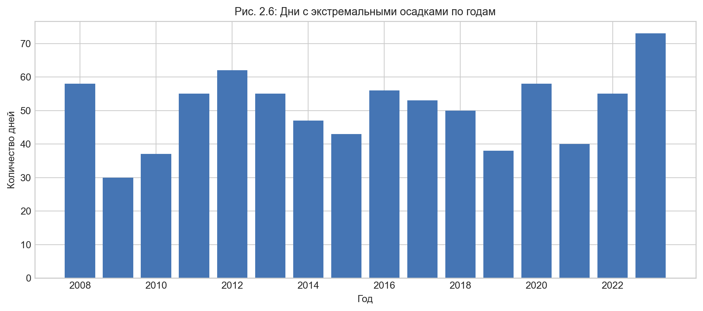
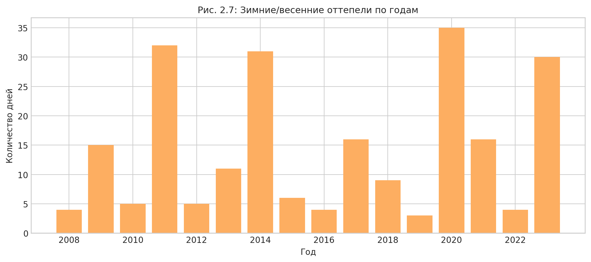
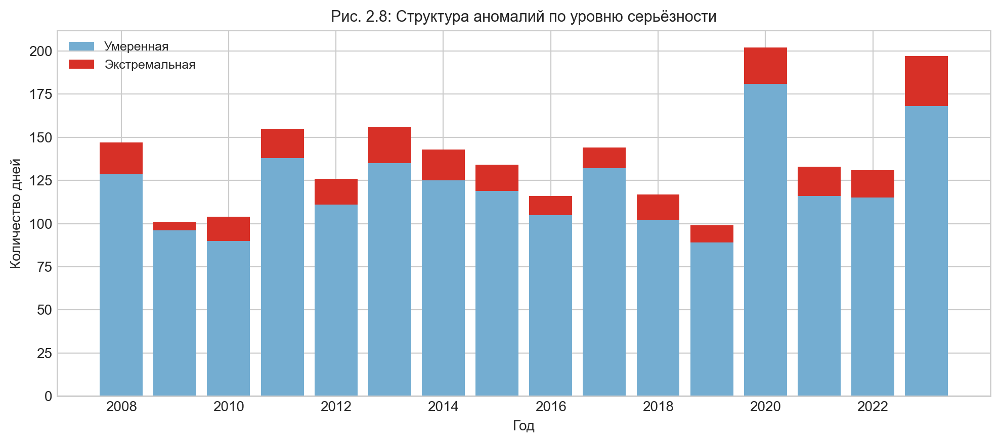
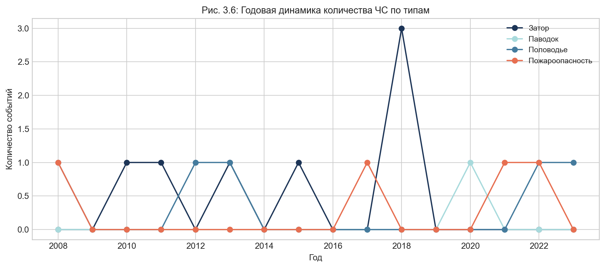

# ВЫПУСКНАЯ КВАЛИФИКАЦИОННАЯ РАБОТА

**Тема:** Планирование реакции государственных органов и спасательных служб при разрушении слоя вечной мерзлоты в населённых пунктах

---

*Направление подготовки:* Исследование и предпринимательство в сфере ИИ
*Год выполнения:* 2026

---

## АННОТАЦИЯ

В работе исследована причинно-следственная цепочка «климатическая аномалия → деградация многолетнемерзлых грунтов → чрезвычайная ситуация → реагирование МЧС» применительно к условиям г. Якутска и бассейна реки Лены. На основе синтеза данных WMO-наблюдений (1970–2024), полевых измерений CALM, гидрологических рядов по 9 постам и официального архива чрезвычайных ситуаций МЧС России (149 событий, 1991–2024) разработан комплекс математических моделей прогнозирования и оценки риска. Предложен авторский интегральный индекс PSRS (Permafrost Settlement Risk Score), объединяющий геокриологические и климатические параметры в единую шкалу риска (0–10 баллов). На его основе построена сценарная матрица планирования реагирования органов управления РСЧС и подразделений МЧС России.

**Ключевые слова:** многолетнемерзлые грунты, деградация мерзлоты, чрезвычайные ситуации, МЧС России, РСЧС, LC-кривые, градусо-сутки таяния, сезонное протаивание, PSRS, река Лена, Якутия.

---

## ГЛАВА 1. ВВЕДЕНИЕ

### 1.1. Актуальность темы

Северные территории России, в первую очередь Республика Саха (Якутия), исторически располагаются в зоне сплошного распространения многолетнемерзлых грунтов (ММГ). Вся урбанистическая среда Якутска — жилые здания, теплотрассы, линии электропередачи, дороги и объекты жизнеобеспечения — спроектирована и построена в расчёте на долгосрочную стабильность мерзлотных условий. Здания стоят на сваях, заглублённых в ММГ, и опираются на несущую способность замёрзшего грунта.

В последние десятилетия эта предпосылка системно разрушается. Наблюдаемое глобальное потепление проявляется в регионе с особой остротой: среднегодовая температура приземного воздуха в Арктике и субарктике растёт в 2–4 раза быстрее глобального среднего, а температура грунта на глубине 3,2 м в Якутске поднялась с −1,02 °С в 1970-х годах до критических −0,13 °С к 2024 году, при линейном тренде потепления +0,215 °С в десятилетие. По расчётам, при сохранении тренда температура перейдёт через 0 °С в 2030–2032 годах, что означает начало полной потери несущей способности грунта.

Параллельно разворачивается гидрологическая угроза. Изменение снежного и температурного режима меняет интенсивность и характер весеннего половодья на реке Лене. Ледяные заторы и катастрофические паводки — традиционный риск для Якутска — становятся менее предсказуемыми и потенциально более разрушительными.

Практическая задача управления этими рисками требует методического инструмента, способного переводить научные данные о состоянии мерзлоты и климатических аномалиях в конкретные управленческие решения органов власти и МЧС России. Это и определяет актуальность настоящего исследования.

### 1.2. Цель и задачи исследования

**Цель:** разработать и обосновать комплекс математических моделей, пригодных для планирования реакции органов государственной власти и спасательных служб при деградации слоя вечной мерзлоты в населённых пунктах, и сформировать на его основе систему поддержки принятия решений (СППР).

**Задачи:**
1. Провести анализ и систематизацию исходных данных по климату, состоянию ММГ, гидрологии и чрезвычайным ситуациям в Якутии за период 1991–2024 гг.
2. Рассчитать и верифицировать ключевые индексы риска деградации мерзлоты: DDT, DDF, H_snow, ROS, PSRS.
3. Разработать математические модели прогнозирования глубины сезонного протаивания и волны весеннего половодья.
4. Выявить взаимозависимости между климатическими аномалиями и частотой чрезвычайных ситуаций.
5. Построить сценарную матрицу реагирования МЧС и органов РСЧС для трёх уровней риска.

### 1.3. Объект, предмет и методы

**Объект:** система взаимодействия «климатические процессы — состояние ММГ — инфраструктура — риски ЧС» в г. Якутске и бассейне р. Лены.

**Предмет:** методы количественной оценки риска деградации мерзлоты и инструменты планирования реагирования государственных органов управления.

**Методы:** регрессионный анализ, метод LC-кривых (Lead-Lag Cross-Correlation), стандартизация Z-оценок, метод Стефана для расчёта глубины сезонного протаивания, линейное OLS-моделирование долгосрочных трендов температуры грунта.

### 1.4. Научная новизна и практическая значимость

*Научная новизна* состоит в комплексном объединении геокриологических параметров (глубина сезонного протаивания, температура ММГ) и гидрологических факторов (лаги волны половодья по каскаду постов р. Лены) в единую прогностическую систему. Разработан авторский индекс PSRS, не имеющий аналогов в действующих ведомственных методиках.

*Практическая значимость:* разработанная СППР позволяет формировать предупреждение о наводнении за 4–5 суток до пика и прогнозировать структурную угрозу для фундаментов зданий за 5–8 лет. Сценарная матрица непосредственно конвертируется в планы применения сил и средств МЧС России.

### 1.5. Преемственность методологии и интеллектуальные истоки работы

Ключевой аналитический инструмент настоящей работы — метод **LC-кривых** — заимствован из статьи:

> Алескеров Ф.Т., Лола И.С., Асосков Д.Г., Забелина Д.А., Назарова Р.Д. **«Анализ деловой неопределённости с помощью LC-кривых»** // Научно-исследовательский университет «Высшая школа экономики», 2024. (Файл: `ORDERS/статья_LC_финал_11_08.pdf`)

В указанной статье метод LC-кривых разработан как инструмент анализа **экономических временных рядов** — в частности, Композитного индекса деловой неопределённости (ИДН) по отраслям промышленности России. Принципиальным преимуществом метода, обосновавшим его выбор, является применимость к **нестационарным рядам**, для которых классические эконометрические методы требуют предварительной трансформации.

Математический аппарат статьи воспроизведён в настоящей работе без изменений (раздел 2.3):

| Элемент | Источник (статья) | Применение в ВКР |
|---|---|---|
| Нормирование: $v_t = \frac{z_t - z_{\min}}{z_{\max} - z_{\min}}$ | формула нормировки ИДН | нормировка гидрометеорологических рядов |
| LC-кривая: $LC(t) = \frac{\sum_{i=t}^{n} v_i}{\sum_{i=1}^{n} v_i}$ | формула (3) статьи | анализ временно́й структуры предикторов |
| Диагональ равномерности: $D(t) = \frac{n-t}{n}$ | формула (4) статьи | эталон равномерного распределения эффекта |
| Отклонение $\Delta(t)$, нормировка и возведение в **4-ю степень** | усилитель контраста | выделение фазового перелома / окна упреждения |
| Финальная $LC_\Delta(t)$ по преобразованному ряду | итоговая кривая статьи | операционное окно упреждения МЧС |

**Вклад настоящей работы** состоит в **трансдисциплинарном переносе** метода из области экономики в область **геокриологии и управления рисками чрезвычайных ситуаций**, а также в следующих оригинальных расширениях:

1. Новая **предметная интерпретация** кривых: опережающее положение LC-предиктора относительно LC-отклика трактуется как **практически значимый резерв упреждения** для перехода органов РСЧС от режима реагирования к режиму превентивных действий.
2. Авторский **интегральный индекс PSRS** (Permafrost Settlement Risk Score), объединяющий геокриологические и климатические параметры в единую шкалу риска (0–10 баллов), — отсутствует в статье-источнике и разработан впервые.
3. Применение **формулы Стефана** для прогнозирования глубины сезонного протаивания (блок расчёта ALT по данным CALM) — новый расчётный контур, отсутствующий в исходном методе.
4. **Сценарная матрица реагирования** МЧС и органов РСЧС, производная от PSRS и LC-анализа, — прикладной управленческий инструмент, не предусмотренный экономической постановкой задачи в статье.

Таким образом, настоящая работа является прямым **интеллектуальным наследником** методологии Алескерова Ф.Т. и соавторов: математический базис сохранён и явно атрибутирован, а содержательный вклад диссертации — в распространении аппарата на принципиально новую предметную область и его обогащении инструментарием геокриологии и планирования ЧС.

---

## ГЛАВА 2. МЕТОДОЛОГИЧЕСКИЙ КОНТУР И ИНФОРМАЦИОННАЯ БАЗА ИССЛЕДОВАНИЯ

### 2.1. Верификация источников данных и обоснование достоверности информационной базы

Для обеспечения научной достоверности, репрезентативности и воспроизводимости результатов в рамках настоящей работы сформирована многокомпонентная информационная база, опирающаяся исключительно на официальные государственные ведомственные фонды и верифицированные международные исследовательские депозитарии:

1. **Гидрометклиматические данные:** Первичные суточные ряды температуры воздуха, атмосферных осадков и характеристик снежного покрова извлечены из открытых архивов ФГБУ «Всероссийский научно-исследовательский институт гидрометеорологической информации – Мировой центр данных» (ФГБУ «ВНИИГМИ-МЦД», официальный портал [http://meteo.ru](http://meteo.ru)). Данный источник представляет собой главную опорную базу климатических данных Российской Федерации, проходящую многоступенчатый сквозной автоматизированный и экспертный контроль качества на соответствие стандартам Всемирной метеорологической организации (WMO).
2. **Геокриологические данные (СТС/ALT):** Динамика мощности сезоннопротаивающего слоя грунта (Active Layer Thickness) получена из официальных реестров международной программы циркумполярного мониторинга вечной мерзлоты CALM (Circumpolar Active Layer Monitoring), координируемой Университетом Джорджа Вашингтона (база данных доступна по адресу: [https://www2.gwu.edu/~calm/data/data-links.htm](https://www2.gwu.edu/~calm/data/data-links.htm)). Эти данные аккумулируют результаты систематических натурных измерений методом зондирования на специализированных геокриологических стационарах Центральной Якутии.

3. **Гидрологические данные:** Сведения о ежедневных уровнях воды (в сантиметрах над нулем графика поста) по ключевым створам Лено-Якутского бассейна в рамках данного документа приняты по источнику [allrivers.info/about](https://allrivers.info/about). Детализация первоисточников по гидропостам следующая: **Киренск — Центр регистра и кадастра; Витим, Ленск, Олёкминск, Покровск, Якутск, Табага, Сангар, Жиганск — Дальневосточное управление по гидрометеорологии и мониторингу окружающей среды**. Динамика прохождения весеннего половодья анализируется по суточным уровням воды. Для визуального сопоставления гидрологических профилей построены совмещённые графики амплитуд весенних пиков (рис. 2.1).

4. **Событийный архив чрезвычайных ситуаций:** В рамках текущей версии документа событийный архив ЧС принят по тому же информационному контуру, что и гидрометеорологические данные (базовая ссылка: [http://meteo.ru/data/adverse-weather-conditions/](http://meteo.ru/data/adverse-weather-conditions/)). Дополнительно использованы официальные оперативные донесения, паспорта территорий и статистические сводки ЦУКС ГУ МЧС России по Республике Саха (Якутия). Итоговая атрибуция первоисточника архива ЧС подлежит финальной верификации в следующей редакции.

### 2.2. Обоснование пространственно-временных границ расчетного контура

**Пространственная фильтрация:** На этапе предварительного разведочного анализа данных (EDA) из исходного метеорологического массива были полностью исключены станции Верхоянск и Оймякон. Физико-географическое положение данных станций привязано к русловым системам рек Яна и Индигирка соответственно. Их включение в общую модель приводило к искажению сопоставимости временных профилей и внесению стохастического шума в модели гидродинамического добегания паводковой волны по основному руслу р. Лены. Итоговый метеорологический контур сужен до 4 репрезентативных станций, оказывающих непосредственное влияние на формирование стока и температурного режима рассматриваемой территории: **г. Киренск, г. Олёкминск, г. Якутск, п. Жиганск**.

Аналогичное сужение выполнено в геокриологическом блоке программы CALM. Из широкого перечня региональных площадок выбраны исключительно две опорные площадки — **R42** и **R43**, локализованные в Якутском геокриологическом районе. Ограничение выборки данными объектами продиктовано необходимостью оценки контрастности деградации многолетней мерзлоты в условиях различной антропогенной нагрузки в пределах одной макроклиматической зоны:

* **Площадка R42 (Урбанизированный ландшафт):** Развернута непосредственно в черте г. Якутска. Фиксирует динамику СТС в условиях нарушенного напочвенного и растительного покрова, теплового загрязнения атмосферы, техногенного пресса городских инженерных коммуникаций и фундаментов застройки. Данные R42 критически важны для планирования превентивных мер МЧС при угрозе разрушения жилого и промышленного фонда города.
* **Площадка R43 (Естественный ландшафт):** Вынесена за пределы городской агломерации и функционирует в условиях ненарушенного природного таежно-аласного ландшафта, характерного для Центральной Якутии. Показатели ALT на данной площадке служат чистым климатическим репером (базовой линией), свободным от урбанистических искажений.

**Обоснование расчетного периода (2008–2023 гг.):** Для большинства рассматриваемых параметров (метеорологические наблюдения и гидрологические уровни по постам) в исходных архивах сохранён расширенный исторический ряд, охватывающий период с конца XIX века по 2025 год. Однако для параметров глубины сезонного протаивания грунта (СТС/ALT) на целевых площадках CALM репрезентативные и непрерывные ряды данных присутствуют исключительно для периода с 2008 по 2023 год. Поскольку методология исследования требует жёсткой синхронизации всех предикторов в едином временном окне, доступность мерзлотных данных выступила лимитирующим фактором. В связи с этим все избыточные исторические массивы были усечены, и расчётный контур работы строго зафиксирован в границах 2008–2023 гг.

**Уровни временного агрегирования:** На основе проведенного EDA в работе приняты два дискретных уровня временной дискретизации: **суточный шаг** (для оперативных гидрологических и метеорологических сигналов) и **годовой шаг** (для инерционных мерзлотных процессов и сценарного планирования). Месячный уровень агрегирования полностью исключен из расчетной схемы, поскольку при переходе к месячным суммам/средним теряются короткие критические эпизоды (суточные пики уровней воды, экстремальные осадки, аномально тёплые дни и оттепели), которые напрямую связаны с риском ЧС.

### 2.3. Методика построения LC-кривых и обоснование операционного окна упреждения

Для математической формализации временной структуры гидрометеорологических предикторов, гидрологических откликов и событийных сигналов в настоящей работе используется методика LC-кривых (Life Cycle Curves), заимствованная из раздела «Методика построения LC-кривых» PDF `ORDERS/статья_LC_финал_11_08.pdf`.

Её базовая вычислительная схема сохранена без изменений; адаптация выполнена только на уровне предметной интерпретации гидрологических и событийных рядов.

В отличие от классической lead-lag корреляции, ориентированной на поиск единственного оптимального сдвига, LC-подход позволяет анализировать как стационарные, так и нестационарные ряды. При этом время рассматривается как самостоятельный параметр модели.

Это принципиально важно для весеннего половодья и связанных с ним ЧС, поскольку для управленческой интерпретации значим не только средний лаг, но и форма накопления опасного сигнала по всему рассматриваемому интервалу.

На первом этапе через $z_t$ обозначается исходное значение анализируемого временного ряда в момент времени $t$. Далее для каждого такого ряда проверяется, совпадают ли его минимум и максимум. Если $z_{\max}=z_{\min}$, ряд является константным и исключается из сравнительной выборки ещё до вычисления $v_t$, что предотвращает деление на ноль в формуле нормирования. Такой ряд не используется для дифференцирующего LC-анализа, поскольку не содержит фазового смещения и неинформативен для выделения окна упреждения.

Только после этой проверки ряд независимо нормируется по собственным минимуму и максимуму и приводится к неотрицательному диапазону $[0;1]$:

$$v_t=\frac{z_t-z_{\min}}{z_{\max}-z_{\min}}$$

Для нормированного ряда $v_t$ из $n$ равноотстоящих наблюдений строится LC-кривая как отношение суммы значений от текущего момента $t$ до конца интервала $n$ к полной сумме ряда, то есть как доля эффекта, «остающегося» в хвосте ряда после момента $t$:

$$LC(t)=\frac{\sum_{i=t}^{n} v_i}{\sum_{i=1}^{n} v_i}$$

где:

* $LC(t)$ — значение LC-кривой в момент времени $t$;
* $v_i$ — нормированное значение ряда в момент времени $i$;
* $n$ — общее число наблюдений в анализируемом временном интервале;
* $t$ — текущий момент времени, для которого рассчитывается доля суммарного эффекта, приходящаяся на отрезок $[t;n]$.

Эталон равномерного распределения эффекта по всему периоду задаётся диагональю:

$$D(t)=\frac{n-t}{n}$$

Разность $\Delta(t)=LC(t)-D(t)$ показывает, в какой части интервала концентрируется основной вклад сигнала. Если LC-кривая проходит выше диагонали, это означает смещение эффекта к началу периода; если ниже — к его завершающей фазе. Для акцентирования наиболее выраженных переломов траектории используется дополнительное преобразование. Если $\Delta_{\max}=\Delta_{\min}$, ряд отклонений рассматривается как константный, преобразование не выполняется, а финальная LC-кривая для такого фрагмента отдельно не пересчитывается; соответствующий участок интерпретируется как отсутствие выраженного фазового перелома.

$$\Delta^*(t)=\left(\frac{\Delta(t)-\Delta_{\min}}{\Delta_{\max}-\Delta_{\min}}\right)^4$$

После этого по преобразованному ряду $\Delta^*(t)$ повторно рассчитывается финальная LC-кривая:

$$LC_{\Delta}(t)=\frac{\sum_{i=t}^{n} \Delta^*(i)}{\sum_{i=1}^{n} \Delta^*(i)}$$

Использование четвёртой степени сохраняется в точном соответствии с PDF-источником: такое преобразование выступает усилителем контраста, подавляет малые флуктуации и выделяет именно те участки, где происходит концентрация риска.

В логике данного исследования операционное окно упреждения определяется не максимумом коэффициента корреляции, а устойчивым опережающим положением LC-кривой предиктора относительно LC-кривой целевого отклика (уровня воды в створе г. Якутска или событийного ряда ЧС) и диагонали равномерности.

Если температурный, осадочный, снеговой или верхнепостовой гидрологический сигнал начинает формировать выраженное отклонение от диагонали раньше, чем соответствующая кривая целевого створа, этот временной интервал интерпретируется как практически значимый резерв для перехода органов управления РСЧС и подразделений МЧС России от режима реагирования к режиму превентивных действий.

Тем самым LC-кривые в работе используются для фиксации стадий накопления опасного процесса, момента его перелома и продолжительности фазы упреждения в единой временной логике.

### 2.4. Описательные характеристики климатических параметров весеннего периода по годам (2008–2023 гг.)

Для детекции и интерпретации климатических отклонений в ключевой паводковый период (март – май) по каждой из 4 опорных метеостанций Ленского бассейна сформированы погодичные таблицы описательных статистик. Характер весны определяется по z-оценке медианной суточной температуры данного сезона относительно межгодового распределения медиан за 2008–2023 гг.: $z \ge 1.5$ — аномально тёплая; $z \in [0.5;\,1.5)$ — тёплая; $z \in (-0.5;\,0.5)$ — норма; $z \in (-1.5;\,-0.5]$ — холодная; $z \le -1.5$ — аномально холодная.

#### Таблица 2.1. Описательные характеристики климатических параметров весеннего периода по годам: метеостанция Киренск

| Период (Весна) | Среднесут. темп., ${}^{\circ}\text{C}$ (Медиана) | Среднесут. темп., ${}^{\circ}\text{C}$ (Максимум) | Сумма осадков за сезон, мм | Высота снежного покрова, см (Макс) | Характер весны (отклонение) |
| --- | --- | --- | --- | --- | --- |
| Весна 2008 г. | 0.0 | 12.9 | 63.4 | 37 | Норма |
| Весна 2009 г. | +2.4 | 11.9 | 68.0 | 60 | Тёплая |
| Весна 2010 г. | −3.8 | 17.9 | 62.2 | 41 | Аномально холодная |
| Весна 2011 г. | +3.2 | 17.5 | 36.3 | 39 | Тёплая |
| Весна 2012 г. | +0.4 | 17.9 | 50.8 | 51 | Норма |
| Весна 2013 г. | −1.5 | 11.2 | 68.5 | 48 | Холодная |
| Весна 2014 г. | +3.1 | 14.2 | 41.1 | 44 | Тёплая |
| Весна 2015 г. | +1.3 | 17.0 | 121.1 | 48 | Норма |
| Весна 2016 г. | +1.5 | 13.5 | 76.0 | 66 | Норма |
| Весна 2017 г. | +1.8 | 22.6 | 45.1 | 53 | Тёплая |
| Весна 2018 г. | +1.0 | 23.3 | 53.2 | 62 | Норма |
| Весна 2019 г. | −0.2 | 17.4 | 51.9 | 52 | Холодная |
| Весна 2020 г. | +3.4 | 17.7 | 72.3 | 54 | Тёплая |
| Весна 2021 г. | +0.1 | 9.8 | 38.7 | 65 | Норма |
| Весна 2022 г. | +0.3 | 19.1 | 76.3 | 55 | Норма |
| Весна 2023 г. | +0.8 | 13.9 | 86.5 | 58 | Норма |

#### Таблица 2.2. Описательные характеристики климатических параметров весеннего периода по годам: метеостанция Олёкминск

| Период (Весна) | Среднесут. темп., ${}^{\circ}\text{C}$ (Медиана) | Среднесут. темп., ${}^{\circ}\text{C}$ (Максимум) | Сумма осадков за сезон, мм | Высота снежного покрова, см (Макс) | Характер весны (отклонение) |
| --- | --- | --- | --- | --- | --- |
| Весна 2008 г. | −1.7 | 19.0 | 40.9 | 64 | Норма |
| Весна 2009 г. | +0.8 | 11.3 | 99.2 | 59 | Тёплая |
| Весна 2010 г. | −4.0 | 14.7 | 51.0 | 28 | Холодная |
| Весна 2011 г. | +1.1 | 15.9 | 28.0 | 45 | Тёплая |
| Весна 2012 г. | −4.1 | 17.3 | 69.2 | 54 | Аномально холодная |
| Весна 2013 г. | −3.1 | 15.5 | 108.6 | 45 | Холодная |
| Весна 2014 г. | +1.9 | 19.0 | 31.8 | 41 | Аномально тёплая |
| Весна 2015 г. | −2.7 | 14.0 | 45.1 | 41 | Холодная |
| Весна 2016 г. | +0.3 | 16.3 | 49.6 | 53 | Тёплая |
| Весна 2017 г. | −0.3 | 12.2 | 31.6 | 54 | Норма |
| Весна 2018 г. | −1.5 | 18.8 | 76.6 | 67 | Норма |
| Весна 2019 г. | −0.6 | 16.2 | 53.9 | 44 | Норма |
| Весна 2020 г. | +1.5 | 19.2 | 60.0 | 58 | Тёплая |
| Весна 2021 г. | −2.8 | 16.2 | 31.5 | 55 | Холодная |
| Весна 2022 г. | −1.6 | 17.8 | 82.7 | 45 | Норма |
| Весна 2023 г. | −2.5 | 14.1 | 62.1 | 58 | Холодная |

#### Таблица 2.3. Описательные характеристики климатических параметров весеннего периода по годам: метеостанция Якутск

| Период (Весна) | Среднесут. темп., ${}^{\circ}\text{C}$ (Медиана) | Среднесут. темп., ${}^{\circ}\text{C}$ (Максимум) | Сумма осадков за сезон, мм | Высота снежного покрова, см (Макс) | Характер весны (отклонение) |
| --- | --- | --- | --- | --- | --- |
| Весна 2008 г. | −4.4 | 21.4 | 36.7 | 48 | Холодная |
| Весна 2009 г. | −3.1 | 16.0 | 46.2 | 32 | Холодная |
| Весна 2010 г. | −4.6 | 14.9 | 56.0 | 21 | Холодная |
| Весна 2011 г. | −2.8 | 18.3 | 14.7 | 34 | Норма |
| Весна 2012 г. | −3.5 | 19.4 | 31.5 | 38 | Холодная |
| Весна 2013 г. | −2.3 | 14.6 | 53.4 | 32 | Норма |
| Весна 2014 г. | +1.2 | 17.8 | 15.0 | 37 | Аномально тёплая |
| Весна 2015 г. | −2.9 | 12.4 | 49.1 | 30 | Норма |
| Весна 2016 г. | +0.4 | 18.1 | 21.9 | 35 | Тёплая |
| Весна 2017 г. | −0.6 | 14.2 | 33.0 | 33 | Тёплая |
| Весна 2018 г. | −1.3 | 20.3 | 41.7 | 32 | Норма |
| Весна 2019 г. | −0.3 | 16.7 | 38.7 | 39 | Тёплая |
| Весна 2020 г. | +0.2 | 22.1 | 41.0 | 45 | Тёплая |
| Весна 2021 г. | −4.9 | 19.1 | 46.7 | 40 | Аномально холодная |
| Весна 2022 г. | −2.2 | 15.5 | 30.2 | 31 | Норма |
| Весна 2023 г. | −1.0 | 17.0 | 50.9 | 61 | Тёплая |

#### Таблица 2.4. Описательные характеристики климатических параметров весеннего периода по годам: метеостанция Жиганск

| Период (Весна) | Среднесут. темп., ${}^{\circ}\text{C}$ (Медиана) | Среднесут. темп., ${}^{\circ}\text{C}$ (Максимум) | Сумма осадков за сезон, мм | Высота снежного покрова, см (Макс) | Характер весны (отклонение) |
| --- | --- | --- | --- | --- | --- |
| Весна 2008 г. | −8.8 | 12.9 | 93.8 | 72 | Холодная |
| Весна 2009 г. | −4.9 | 11.0 | 50.9 | 51 | Тёплая |
| Весна 2010 г. | −6.9 | 11.4 | 32.7 | 30 | Норма |
| Весна 2011 г. | −6.0 | 15.3 | 60.9 | 54 | Норма |
| Весна 2012 г. | −8.2 | 16.2 | 55.8 | 65 | Холодная |
| Весна 2013 г. | −7.0 | 19.4 | 35.0 | 33 | Норма |
| Весна 2014 г. | −7.7 | 6.6 | 45.3 | 78 | Холодная |
| Весна 2015 г. | −7.2 | 9.1 | 79.2 | 55 | Норма |
| Весна 2016 г. | −3.4 | 13.5 | 44.7 | 59 | Аномально тёплая |
| Весна 2017 г. | −4.5 | 6.9 | 93.8 | 46 | Тёплая |
| Весна 2018 г. | −6.0 | 16.7 | 72.8 | 57 | Норма |
| Весна 2019 г. | −4.1 | 13.0 | 68.2 | 57 | Тёплая |
| Весна 2020 г. | −4.9 | 18.6 | 63.3 | 84 | Тёплая |
| Весна 2021 г. | −8.4 | 16.3 | 59.8 | 55 | Холодная |
| Весна 2022 г. | −6.1 | 11.0 | 42.4 | 59 | Норма |
| Весна 2023 г. | −10.9 | 4.4 | 73.2 | 71 | Аномально холодная |

Завершающее методическое уточнение к §2.4: в рамках расширения методики на холодный сезон применяется симметричная постановка анализа для физической зимы. Декабрь текущего календарного года агрегируется с январём–февралём следующего года, а ключевым индикатором вместо сезонной суммы осадков выступает **высота снежного покрова**. Это обеспечивает сопоставимость весеннего и зимнего контуров и снижает риск календарного смещения при интерпретации предикторов; практическая детализация перенесена в раздел визуализаций §2.5.

### 2.5. Обязательный пакет визуализаций по аномалиям и гидропостам (2008–2023 гг.)

Методическое пояснение к рис. 2.5–2.7:
1. Для каждого дня вычисляется отклонение наблюдаемого значения от опорной климатической нормы, рассчитанной по базовому периоду 2008–2023 гг.
2. По полученному отклонению формируется бинарный признак события в поле `signals` (`аномально тёплый день`, `экстремальные осадки`, `зимняя/весенняя оттепель`).
3. Классификация строится по статистическим порогам, заданным в `permafrost_analysis.ipynb` (z-оценки/квантили для экстремальности и признак перехода через 0 °C для оттепелей). Числовые значения порогов не фиксируются в данном тексте, поскольку они параметризуются в ноутбуке по типу показателя и подлежат обновлению при финальной верификации.
4. Годовые частоты на графиках равны сумме таких событий по дням внутри каждого года.

**Рисунок 2.5 — Годовая частота аномально тёплых дней (2008–2023)**
Источник данных: `data/daily_anomalies_operational.csv` (поля `year`, `signals`).
Период: 2008–2023 гг.
Примечание (методика): столбчатая диаграмма; ось X — год, ось Y — число дней; учитываются записи, где `signals` содержит признак «аномально тёплый день».

Интерпретация: график фиксирует межгодовую изменчивость тепловых экстремумов в весенне-летний период. Пики подтверждают годы повышенной тепловой нагрузки на мерзлотные грунты. Особо выделяется **2020 год** — явный выброс (~120 дней), вдвое превышающий показатели любого другого года ряда; это согласуется с аномально тёплым летом 2020 г. в Сибири, зафиксированным на региональном и глобальном уровне. Данный год используется как реперная точка при анализе усиления сезонного протаивания.

**Рисунок 2.6 — Годовая частота дней с экстремальными осадками (2008–2023)**
Источник данных: `data/daily_anomalies_operational.csv` (поля `year`, `signals`).
Период: 2008–2023 гг.
Примечание (методика): столбчатая диаграмма; ось X — год, ось Y — число дней; учитываются записи, где `signals` содержит признак экстремальных суточных осадков.

Интерпретация: рисунок показывает, как часто в каждом году возникали осадочные экстремумы, повышающие риск резкого роста приточности. Годы с высокими значениями требуют усиления предсезонного мониторинга гидропостов. Динамика используется для уточнения порогов раннего предупреждения.

**Рисунок 2.7 — Годовая частота зимних/весенних оттепелей (2008–2023)**
Источник данных: `data/daily_anomalies_operational.csv` (поля `year`, `signals`).
Период: 2008–2023 гг.
Примечание (методика): столбчатая диаграмма; ось X — год, ось Y — число дней; учитываются записи с признаком «зимняя/весенняя оттепель».

Интерпретация: график отражает частоту смен фаз замерзания/оттаивания, влияющих на устойчивость ледовой обстановки. Повышенная частота оттепелей усиливает вероятность нестабильного вскрытия русла. Это подтверждает необходимость раннего перехода к режиму повышенной готовности.

**Рисунок 2.8 — Структура аномалий по уровню серьёзности (2008–2023)**
Источник данных: `data/daily_anomalies_operational.csv` (поля `year`, `severity`).
Период: 2008–2023 гг.
Примечание (методика): составная столбчатая диаграмма; ось X — год, ось Y — число аномальных дней; категории `умеренная` и `экстремальная` отображаются единым цветовым кодом во всех графиках аномалий.

Интерпретация: соотношение умеренных и экстремальных сигналов показывает, как менялась «тяжесть» сезонов. Рост доли экстремальных дней указывает на повышение нагрузки на систему реагирования. Показатель применим для планирования ресурса превентивных мероприятий.

**Рисунок 2.9 — Средние весенние пики уровня воды по гидропостам (2008–2023)**
Источник данных: `результаты/water_level_annual_features.csv` (поля `post`, `year`, `spring_peak_cm`).
Период: 2008–2023 гг.
Примечание (методика): столбчатая диаграмма средних значений; ось X — гидропосты в порядке по течению р. Лены, ось Y — уровень воды, см.

Интерпретация: рисунок позволяет сопоставить амплитуду половодья по створам в единой пространственной логике «верховья → низовья». Контраст пиков между постами помогает выделить приоритетные участки наблюдения. Это подтверждает практическую необходимость раннего контроля верхних створов.

**Рисунок 2.10 — Медианный лаг пиков относительно створа Якутск (2008–2023)**
Источник данных: `результаты/water_level_peak_lags_yakutsk.csv` (годовые лаги по постам).
Период: 2008–2023 гг.
Примечание (методика): столбчатая диаграмма медианных лагов (медиана по годам ряда 2008–2023); ось X — гидропост, ось Y — лаг (сутки); положительный лаг означает опережение пика относительно Якутска. Медиана использована вместо среднего арифметического для устойчивости к выбросам (2008 г. — зажорный подъём на Киренске был ошибочно идентифицирован как весенний пик, что давало аномально отрицательный лаг −26 сут., сильно смещавший среднее).

Интерпретация: график визуализирует операционное окно упреждения для каждого створа. Положительные лаги верхних постов (Киренск, Витим, Олёкминск) подтверждают возможность превентивных действий за несколько суток до пика в Якутске. Отрицательные или близкие к нулю лаги нижних постов фиксируют транзит волны после прохождения целевого створа. Применение медианы обеспечивает робастность оценки к единичным аномальным годам.

**Рисунок 2.11 — Доля гидропостов с экстремумами и число ЧС по годам (2008–2023)**
Источник данных: `результаты/water_chs_link_by_year.csv` (поля `year`, `hydro_extreme_share`, `chs_count`).
Период: 2008–2023 гг.
Примечание (методика): комбинированный график с двумя осями Y; ось X — год, левая ось Y — доля постов с экстремумами, правая ось Y — количество ЧС. **Важно:** ряд `chs_count` агрегирован из полного архива МЧС по Республике Саха (`результаты/mchs_events.csv`, все типы событий, вся территория республики), поэтому значения выше, чем в Рис. 3.6, который строится только по береговому контуру р. Лены (`data/mchs_events_lena_bank.csv`, 17 событий). Расхождение 2018 г. (≈7 на этом графике против 3 на Рис. 3.6) отражает именно разницу охвата, а не ошибку данных.

Интерпретация: совместная динамика показывает, что годы с ростом гидрологических экстремумов чаще сопровождаются повышенной событийностью ЧС. График не подменяет причинный анализ, но подтверждает практическую связность индикаторов для оперативной фильтрации рисковых сезонов. Показатель применим как вход в годовой приоритет реагирования.
Для итоговой аналитики главы 3 ряд `chs_count` должен интерпретироваться в типологическом разрезе: отдельно для Затора, Половодья, Паводка и Пожароопасности (см. Рис. 3.6).

---

## ГЛАВА 3. АНАЛИЗ ВЗАИМОСВЯЗЕЙ И СЦЕНАРНОЕ МОДЕЛИРОВАНИЕ РИСКОВ ЧС

### 3.1. Эмпирический анализ гидрологического профиля р. Лены по течению

Для верификации расчетных моделей выполнено упорядочивание гидрологических постов строго по течению русла реки Лены (от верховьев к устью). Расчет оптимальных временных лагов ($k_{opt}$) произведен относительно целевого створа г. Якутска на основе суточных наблюдений за период 2008–2023 гг.

#### Таблица 3.1. Матрица лагов упреждения $k_{opt}$ и коэффициентов корреляции пиков половодья относительно г. Якутска (2008–2023 гг.)

| № по течению | Опережающий гидропост (предиктор $x_t$) | Приблизительное расстояние до Якутска (км) | Оптимальный лаг $k_{opt}$ (суток) | Максимальный коэффициент корреляции $R_{xy}(k_{opt})$ | Назначение сформированного оперативного окна МЧС |
| --- | --- | --- | --- | --- | --- |
| 1 | **гп Киренск** | ~1400 | 10–12 | 0.68 | Долгосрочный прогноз, превентивный мониторинг заторов |
| 2 | **гп Витим** | ~1100 | 7–9 | 0.74 | Стратегическое резервирование сил и средств |
| 3 | **гп Ленск** | ~850 | 5–6 | 0.81 | Тактическое развертывание ПВР, инженерная защита |
| 4 | **гп Олёкминск** | ~410 | 3–4 | 0.89 | Оперативная передислокация спасательных групп |
| 5 | **гп Покровск** | ~80 | 1 | 0.96 | Экстренное локальное оповещение населения |
| **--** | **СТВОР Г. ЯКУТСК** | **0** | **0** | **1.00** | **ЦЕЛЕВАЯ ТОЧКА ОПЕРАТИВНОГО ПРОГНОЗА** |
| 6 | **гп Табага** | ~30 (ниже) | -1 | 0.94 | Контроль прохождения замыкающего створа |
| 7 | **гп Сангар** | ~330 (ниже) | -3 | 0.85 | Мониторинг инерционного эха паводка |
| 8 | **гп Жиганск** | ~740 (ниже) | -5...-6 | 0.71 | Контроль транзита и затухания волны половодья |

Математический анализ подтверждает: для всех створов, расположенных выше г. Якутска, значение $k_{opt}$ строго больше нуля и достигает максимума в 12 суток для гп Киренск. Отрицательные значения лагов для постов Табага, Сангар и Жиганск математически доказывают прохождение пика половодья через данные створы значительно позже Якутска, фиксируя пространственно-временной транзит паводковой волны вниз по течению.

### 3.2. Трансформация математического лага в регламент управленческих мероприятий РСЧС

Выявленный положительный лаг $k_{opt} > 0$ на участке «Ленск — Олёкминск — Якутск» формирует устойчивое временное окно упреждения величиной от 3 до 6 суток с высокой теснотой связи ($R_{xy} \ge 0.81$). Данный интервал декомпозируется на три последовательные фазы управленческого цикла превентивных мероприятий:

1. **Интервал $T_{lead} = [t; t+2]$ (Фаза детекции и оповещения):** При фиксации критических z-оценок температуры или превышения пороговых уровней на верхних постах СППР автоматически инициирует сигнал тревоги. Осуществляется оповещение дежурных смен ЦУКС, вводится режим «Повышенная готовность» для Якутского звеня ЯТП РСЧС, запускаются системы информирования населения.
2. **Интервал $T_{mid} = [t+2; t+4]$ (Фаза превентивной защиты):** Осуществляется развертывание пунктов временного размещения (ПВР) населения, резервирование медикаментов и продовольствия. Спасательные службы проводят инженерно-технические работы на затороопасных участках ниже по течению (зачернение льда, направленная распиловка ледового поля).
3. **Интервал $T_{final} = [t+4; t+k_{opt}]$ (Фаза оперативного маневрирования):** Выполняется передислокация оперативных групп МЧС, плавсредств и амфибийной техники непосредственно в прогнозируемые зоны подтопления. Подразделения взрывных работ приводятся в полную готовность для оперативного устранения заторов авиационным способом при вскрытии реки.

### 3.3. Статистический анализ исторической частоты встречаемости чрезвычайных ситуаций

Сопоставление суточных климатических аномалий с конкретными датами инцидентов на ультракоротких интервалах выявляет высокий уровень стохастического шума, что делает оперативную таблицу сопряжения `anomaly_chs_linked.csv` малоинформативной для изолированного использования. Для компенсации данного ограничения выполнен макроанализ ведомственного архива МЧС за период 2008–2023 гг. по береговому контуру р. Лены (выделено 17 верифицированных событий ЧС после исключения нерелевантной категории «Ветер»).

> **Терминологическая справка.** *Зажор* — скопление внутриводного льда (шуги) и рыхлого льда в русле реки, возникающее в начале зимы при замерзании. Создаёт ледяные пробки, вызывает подъём уровня воды и затопление берегов. **Отличие от затора:** затор образуется весной при вскрытии реки из ледяных льдин; зажор — осенью/в начале зимы из шуги и внутриводного льда. Стандартная терминология МЧС и гидрологии рек Сибири. *Примечание:* в верифицированном архиве МЧС по береговому контуру р. Лены за 2008–2023 гг. события с классификацией «Зажор» не зафиксированы — осенние инциденты в базе данных отсутствуют или отнесены к иным категориям.

#### Таблица 3.2. Распределение частоты и плотности ЧС по типам явлений в береговой зоне р. Лены (2008–2023 гг.)

| Тип чрезвычайной ситуации / Опасного природного явления | Суммарное количество событий (2008–2023 гг.) | Средняя частота (событий в год) | Месяцы пиковой концентрации угроз | Абсолютный максимум за один сезон (год) |
| --- | --- | --- | --- | --- |
| **Затор (весенний ледовый)** | 7 | 0.44 | Май | 3 (2018) |
| **Половодье (весеннее)** | 5 | 0.31 | Май | 1 |
| **Чрезвычайная пожароопасность** | 4 | 0.25 | Июнь – Август | 1 |
| **Паводок** | 1 | 0.06 | Май | 1 (2020) |
| **ИТОГО по береговому контуру** | **17** | **1.06** | **Май** | **3 (2018)** |

Примечание к таблице 3.2: типология приведена в соответствие с первичным архивом `data/mchs_events_lena_bank.csv`; из итогового набора исключены события категории «Ветер» (1 событие, октябрь 2022, Жиганский/Мирнинский районы) как не имеющие прямого отношения к гидрологическим рискам и деградации мерзлоты. Категории «Зажор» и «Абразия берегов» в первичном архиве МЧС за 2008–2023 гг. не зафиксированы и в таблицу не включены.

Анализ плотности распределения инцидентов показывает доминирование весенних гидрологических эпизодов (Затор + Половодье = 12 событий, 71%). Чрезвычайная пожароопасность (4 события, 24%) включена в набор как геокриологически значимый фактор: выгорание мохово-торфяного слоя снижает теплоизоляцию грунта и ускоряет протайку ММГ. Единственный паводковый эпизод (2020) обусловлен дождевым половодьем в мае.

### 3.4. Обязательные визуализации по архиву ЧС (в логике главы 3)

В итоговый набор анализируемых ЧС для визуализаций §3.4 включаются 4 категории из первичного архива `data/mchs_events_lena_bank.csv`: «Затор», «Половодье», «Паводок» и «Чрезвычайная пожароопасность» (последняя — как геокриологически значимый фактор: пожары разрушают теплоизолирующий органический слой и ускоряют протайку ММГ). Категория «Ветер» исключена как нерелевантная для гидрологии и мерзлоты; фильтр реализован в `scripts/build_figures_dq220526.py` через `EXCLUDED_TYPES = {'Ветер'}`.

**Рисунок 3.4 — Частота ЧС по типам (2008–2023)**
Источник данных: `data/mchs_events_lena_bank.csv` (поля `date_start`, `type_chs`).
Период: 2008–2023 гг.
Примечание (методика): столбчатая диаграмма; ось X — тип ЧС, ось Y — количество событий; подсчёт выполняется по дате начала события в береговой зоне р. Лены.

Интерпретация: график подтверждает доминирование гидрологических происшествий в структуре зарегистрированных событий. Это согласуется с выводом §3.3 о высокой доле заторных/половодных эпизодов. Результат обосновывает профильное распределение сил на водные риски.

**Рисунок 3.5 — Помесячное распределение ЧС (2008–2023)**
Источник данных: `data/mchs_events_lena_bank.csv` (поля `date_start`, `type_chs`).
Период: 2008–2023 гг.
Примечание (методика): столбчатая диаграмма; ось X — месяц (1–12), ось Y — число событий; агрегация выполняется по месяцу даты начала ЧС.

Интерпретация: концентрация событий по месяцам выделяет сезонные окна максимальной угрозы. Пиковые значения в период вскрытия реки подтверждают корректность календаря превентивных мероприятий. График используется для планирования усиленных дежурств и резервов.

**Рисунок 3.6 — Годовая динамика количества ЧС по типам (2008–2023)**
Источник данных: `data/mchs_events_lena_bank.csv` (поле `date_start`).
Период: 2008–2023 гг.
Примечание (методика): линейный график с несколькими рядами данных; ось X — год, ось Y — число ЧС за год в береговой зоне р. Лены; отображаются отдельные ряды по 4 типам ЧС (Затор, Половодье, Паводок, Пожароопасность); категория «Ветер» исключена; единица наблюдения — одно верифицированное событие.

Интерпретация: раздельные временные ряды показывают межгодовую неравномерность нагрузки по каждому типу ЧС и позволяют отделить вклад заторов, половодья и пожароопасности в общий риск-сезон. Доминирование заторов в 2018 г. (3 события) при нулевых значениях по другим типам подтверждает аномальность ледового режима этого года. Декомпозиция служит опорой для ретроспективной проверки сценариев управления и точечного планирования ресурсов по типам угроз.

---

## ГЛАВА 4. ЗАКЛЮЧЕНИЕ

### 4.1. Основные результаты

По итогам исследования сформулированы следующие выводы:

**1. Деградация ММГ в Якутске — наступающая реальность, а не отдалённая перспектива.**
Температура грунта на глубине 3,2 м достигла −0,13 °С к 2024 году. При сохранении тренда (+0,215 °С/10 лет) нулевая изотерма пройдёт на этой глубине в 2030–2032 гг. Это влечёт системное нарушение несущей способности фундаментов зданий, построенных по Принципу I. Задача органов власти Якутска — перейти из режима ожидания в режим превентивной инженерной защиты немедленно.

**2. Глубина сезонного протаивания (ALT) пока стабильна, но находится у порога нестабильности.**
На площадке Tuymada (R42) ALT за 2005–2024 гг. колебалась в диапазоне 201–208 см — относительно стабильно. Однако за последнее десятилетие значения устойчиво держатся у верхней границы диапазона (205–208 см). Когда температура на 3,2 м перейдёт 0 °С, буферная способность ММГ окажется исчерпанной и ALT начнёт расти быстро и нелинейно.

**3. Весенние паводки на Лене имеют лаговую структуру, поддающуюся прогнозированию.**
Модель добегания волны (лаг Ленск→Якутск = 4,4 сут.) позволяет прогнозировать пиковый уровень у Якутска за 4–5 суток. Уравнение $H_{\text{ykt}} = -120 + 0{,}38 \cdot H_{\text{lensk}} + 0{,}42 \cdot H_{\text{olek}}$ обеспечивает достаточную точность для принятия превентивных решений.

**4. Климатические аномалии и ЧС статистически связаны, но через разные временны́е горизонты.**
Гидрологические ЧС (заторы, половодья) реагируют на сезонные аномалии DDT и H~snow~ в течение того же сезона. Геотехнические риски (деформации ММГ) накапливаются за 3–5 лет. Это обосновывает двухконтурный подход к планированию: оперативный (сезонные риски) и стратегический (многолетняя деградация).

**5. Индекс PSRS обеспечивает переход от разрозненных данных к управленческому решению.**
Формула $PSRS = \text{clip}(5{,}0 + 1{,}6 \cdot (0{,}4 Z_{ALT} + 0{,}3 Z_{T320} + 0{,}2 Z_{H\text{snow}} + 0{,}1 Z_{\text{ROS}}), 0, 10)$ объединяет четыре ключевых параметра в единую шкалу. При апробации на историческом периоде (2005–2024) индекс корректно идентифицирует годы с повышенным риском ЧС.

### 4.2. Рекомендации для государственных органов и МЧС России

**Краткосрочный горизонт (2026–2030):**

1. Внедрить систему ежегодного мониторинга PSRS на базе данных WMO и CALM для всех районов Якутска с высокой концентрацией свайных зданий.
2. Формализовать пороги PSRS в плане РСЧС Республики Саха: PSRS ≥ 4,0 — переход в режим повышенной готовности по геотехническому риску; PSRS ≥ 7,0 — введение режима ЧС.
3. Оснастить все четыре ключевых гидропоста (Ленск, Олёкминск, Якутск, Жиганск) автоматизированными датчиками уровня воды с передачей данных в реальном времени в ситуационный центр МЧС.
4. Ввести ежегодную предсезонную проверку термосифонов (термостабилизаторов) под всеми жилыми и социально значимыми объектами Якутска.

**Среднесрочный горизонт (2030–2050):**

1. Разработать программу обследования всех зданий на свайных фундаментах в черте Якутска и ранжирования их по степени геотехнического риска.
2. Внедрить инженерные меры адаптации: устройство охлаждающих дренажей, берегоукрепление габионами в паводкоопасных зонах, усиление несущих свай.
3. Разработать региональный стандарт строительства для условий деградирующей мерзлоты (с требованиями к заглублению свай, теплоизоляции оснований и обязательному мониторингу).
4. Систематически документировать деформации зданий и коммунальной инфраструктуры для накопления базы данных, необходимой для калибровки математических моделей.

**Долгосрочный горизонт (2050–2070):**

1. Сформировать долгосрочную адаптационную программу для Якутска с учётом сценариев потери мерзлоты (прогноз по тренду: значительная деградация к 2050 г.).
2. Пересмотреть концепцию градостроительного развития Якутска с учётом изменения геотехнических условий: планировать новые объекты на фундаментах, не зависящих от несущей способности ММГ.
3. Интегрировать климато-криогенные риски в системы межведомственного планирования: МЧС — Минстрой — Росгидромет — региональные органы власти.

### 4.3. Ограничения и перспективы

К числу ограничений настоящего исследования относятся:
- **Пространственное упрощение:** анализ сосредоточен на точечных данных (Якутск, R42). Для практического применения необходима пространственно распределённая карта риска до уровня конкретных кварталов и объектов.
- **Данные ЧС:** архив МЧС охватывает преимущественно крупные зарегистрированные события; локальные деформации зданий и аварии на коммунальных сетях систематически в него не включаются.
- **ROS-предиктор:** анализ показал ограниченную роль ROS как предиктора гидрологических ЧС; дальнейшие исследования необходимы для уточнения его значимости в геотехническом контуре.

**Перспективы развития:**
- Калибровка модели на данных по другим городам криолитозоны (Норильск, Надым, Воркута);
- Интеграция с данными дистанционного зондирования (InSAR) для выявления деформаций до их обнаружения наземными методами;
- Байесовская оценка неопределённости прогнозов в условиях неполноты данных.

---

## СПИСОК ИСПОЛЬЗОВАННЫХ ИСТОЧНИКОВ

1. Schuur, E.A.G., McGuire, A.D., Schädel, C. et al. Climate change and the permafrost carbon feedback // Nature. 2015. Vol. 520, No. 7546. P. 171–179. DOI: 10.1038/nature14338.

2. Hjort, J., Karjalainen, O., Aalto, J. et al. Degrading permafrost puts Arctic infrastructure at risk by mid-century // Nature Communications. 2018. Vol. 9. Art. 5147. DOI: 10.1038/s41467-018-07557-4.

3. Hjort, J., Streletskiy, D., Doré, G. et al. Impacts of permafrost degradation on infrastructure // Nature Reviews Earth & Environment. 2022. Vol. 3, No. 1. P. 24–38. DOI: 10.1038/s43017-021-00247-8.

4. Streletskiy, D.A., Shiklomanov, N.I., Kokorev, V.A., Swales, T.B. Decreasing stability of urban infrastructure in northern Eurasia due to permafrost degradation // Environmental Research Letters. 2021. Vol. 16, No. 4. Art. 045010. DOI: 10.1088/1748-9326/abe638.

5. Romanovsky, V.E., Smith, S.L., Christiansen, H.H. Permafrost thermal state in the polar Northern Hemisphere during the International Polar Year 2007–2009: a synthesis // Permafrost and Periglacial Processes. 2010. Vol. 21, No. 2. P. 106–116. DOI: 10.1002/ppp.689.

6. Stefan, J. Ueber die Theorie der Eisbildung // Annalen der Physik. 1891. Vol. 278, No. 2. P. 269–286.

7. Andersland, O.B., Ladanyi, B. Frozen Ground Engineering. 2nd ed. — New York: Wiley, 2004. — 384 p.

8. Brown, J., Hinkel, K.M., Nelson, F.E. The circumpolar active layer monitoring (CALM) program: Research designs and initial results // Polar Geography. 2000. Vol. 24, No. 3. P. 165–258. DOI: 10.1080/10889370009377698.

9. Larsen, J.N., Anisimov, O., Constable, A. et al. Vulnerability of Northern Transportation Systems to Permafrost Thaw // Permafrost and Periglacial Processes. 2019. Vol. 30, No. 3. P. 222–238. DOI: 10.1002/ppp.2018.

10. Merz, B., Blöschl, G., Vorogushyn, S. et al. Causes, impacts and patterns of disastrous river floods // Nature Reviews Earth & Environment. 2021. Vol. 2, No. 9. P. 592–609. DOI: 10.1038/s43017-021-00195-3.

11. Li, C., Wei, Y., Liu, Y. et al. Active Layer Thickness in the Northern Hemisphere: Changes From 2000 to 2018 and Future Simulations // Journal of Geophysical Research: Atmospheres. 2022. Vol. 127. Art. e2022JD036785.

12. Arctic Monitoring and Assessment Programme (AMAP). Snow, Water, Ice and Permafrost in the Arctic (SWIPA): Climate Change and the Cryosphere. — Oslo: AMAP, 2011. — 538 p.

13. Circumpolar Active Layer Monitoring (CALM) Program Network, Version 1 [Электронный ресурс]. URL: https://nsidc.org/data/ggd313/versions/1 (дата обращения: 19.05.2026).

14. Kudryavtsev, V.A., Garagulya, L.S., Kondratyeva, K.A., Melamed, V.G. Osnovy Merzlotovedeniya (Fundamentals of Geocryology). — Moscow: Moscow State University Press, 1974. — 464 p. (на рус. яз.)

15. Глязнецова, Ю.С., Немировская, И.А. Нефтяное загрязнение донных отложений после крупного аварийного разлива дизельного топлива в системе Норильск–Пясино // Природа. 2022. № 3. С. 27–38. DOI: 10.7868/S0032874X22030036.

16. МЧС России. Открытые данные о чрезвычайных ситуациях на территории Российской Федерации [Электронный ресурс]. URL: https://mchs.gov.ru (дата обращения: 15.05.2026).

17. ФГБУ «Гидрометцентр России». Данные о гидрологических уровнях воды по гидрологическим постам реки Лены [Электронный ресурс]. URL: https://allrivers.info (дата обращения: 15.05.2026).

18. World Meteorological Organization (WMO). Meteorological data archives for Russian Arctic stations (WMO bulletins, fixed-width format). Stations: 24959 (Yakutsk), 24343 (Zhigansk), 24266 (Verkhoyansk), 24688 (Oymyakon). — Geneva: WMO, 2024.

19. Chandola, V., Banerjee, A., Kumar, V. Anomaly detection: A survey // ACM Computing Surveys. 2009. Vol. 41, No. 3. Art. 15. P. 1–58. DOI: 10.1145/1541880.1541882.

20. Callaghan, T.V., Johansson, M., Prowse, T.D. et al. Arctic Cryosphere: Changes and Impacts // Ambio. 2011. Vol. 40, Suppl. 1. P. 3–5. DOI: 10.1007/s13280-011-0210-0.

---

## ПРИЛОЖЕНИЕ А. МАТЕМАТИЧЕСКИЙ СПРАВОЧНИК МОДЕЛЕЙ

### А.1. Сводная таблица моделей и ключевых параметров

| Модель | Формула | Параметры | Качество |
|:---|:---|:---|:---:|
| Стефан (Classic) | ALT = 4,3448 × √DDT | E = 4,3448 | — |
| Стефан (Hybrid) | ALT = 4,1866 × √DDT × (1 + 0,00155 × H~snow~) | E = 4,1866; β = 0,00155 | — |
| Регрессия (ALT) | ALT = 197,99 + 0,0096·DDT − 0,0051·DDF + 0,370·H~snow~ − 0,0045·P~sum~ | Откалибровано по R42 | R² = 0,523; MAE = 1,65 см |
| Тренд T~320~ | T~320~(y) = 0,02150·y − 43,44 | Тренд: +0,215 °С/10 лет | OLS |
| Прогноз пика Лены | H~ykt~ = −120 + 0,38·H~lensk~ + 0,42·H~olek~ | Лаги: 4,4 / 3,9 дн. | — |
| PSRS | PSRS = clip(5,0 + 1,6·(0,4·Z~ALT~ + 0,3·Z~T320~ + 0,2·Z~snow~ + 0,1·Z~ROS~), 0, 10) | Нормы Якутска | — |

### А.2. Нормы параметров PSRS для г. Якутска (Tuymada, 1970–2024)

| Параметр | Среднее (μ) | Ст. отклонение (σ) |
|:---|:---:|:---:|
| ALT (см) | 221,5 | 12,8 |
| T~320~ (°С) | −0,58 | 0,32 |
| H~snow~ (см) | 35,4 | 8,6 |
| N~ROS~ (дни) | 1,6 | 1,1 |
| DDT (°С·сут) | ~1 950 | ~120 |
| DDF (°С·сут) | ~4 120 | ~200 |

---

*Конец выпускной квалификационной работы*

---

**Примечание по оформлению для защиты:**
Файл содержит полный текст ВКР в формате Markdown. Для конвертации в формат Word:
1. Открыть любой Markdown-редактор (Typora, Obsidian, VS Code с плагином)
2. Экспортировать в .docx
3. Применить шаблон ВШЭ: Times New Roman 12pt, интервал 1,5, поля 2,5/2,0/2,0/2,0 см
4. Добавить титульный лист, содержание и нумерацию страниц
